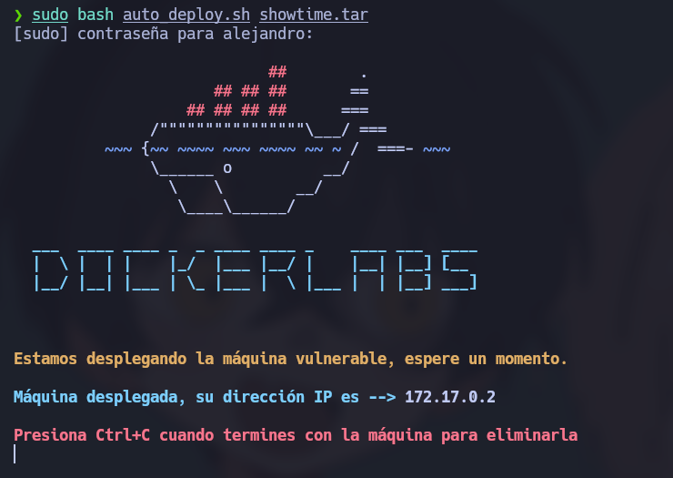
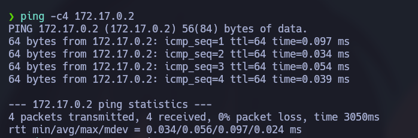
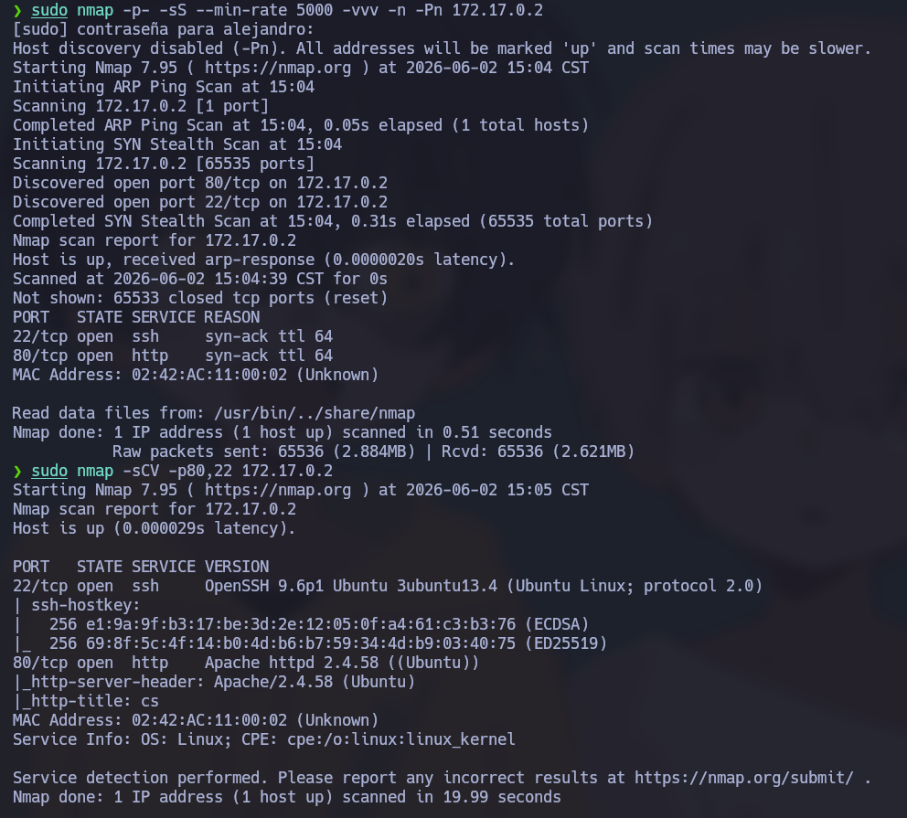

# 🧠 **Informe de Pentesting – Máquina: Showtime**

### 💡 **Dificultad:** Fácil

### 🧩 **Plataforma:** DockerLabs


---

# ⚙️ **Despliegue de la máquina**

Antes de iniciar el proceso de reconocimiento y explotación, se procede a desplegar la máquina vulnerable proporcionada por DockerLabs.

La máquina se distribuye comprimida en formato `.zip`, conteniendo una imagen Docker y un script automatizado para facilitar su ejecución.

```bash
unzip showtime.zip
sudo bash auto_deploy.sh showtime.tar
```
Una vez finalizado el proceso, la máquina queda disponible dentro de la red Docker local.



---

# 📡 **Comprobación de conectividad**

Antes de comenzar la enumeración, es importante verificar que el objetivo se encuentra encendido y responde dentro de la red.

```bash
ping -c1 172.17.0.2
```

### Explicación:

* **ping** → Utilidad utilizada para verificar conectividad ICMP.
* **-c1** → Envía únicamente un paquete.

La recepción de respuesta confirma:

* Existencia del host
* Conectividad de red
* Baja latencia esperada al encontrarse dentro de Docker



---

# 🔍 **Fase de Reconocimiento – Escaneo de Puertos**

La enumeración inicial comienza identificando los puertos expuestos.

Se realiza un escaneo completo sobre todos los puertos TCP:

```bash
sudo nmap -p- --open -sS --min-rate 5000 -vvv -n -Pn 172.17.0.2
```

## Explicación detallada de parámetros:

* **-p-** → Escanea los 65535 puertos TCP.
* **--open** → Muestra únicamente puertos abiertos.
* **-sS** → Realiza SYN Scan (Stealth Scan).
* **--min-rate 5000** → Fuerza una velocidad mínima de envío de paquetes.
* **-vvv** → Incrementa la verbosidad.
* **-n** → Evita resolución DNS.
* **-Pn** → Omite detección previa de host activo.

---

## 📌 Resultado obtenido

Se identifica:

* **22/tcp → SSH**
* **80/tcp → HTTP**

Esto indica que la superficie de ataque inicial está centrada en aplicaciones web.

---

## Enumeración de servicios

Una vez identificados los puertos abiertos, se ejecuta un escaneo más profundo:

```bash
nmap -sCV -p21,80 172.17.0.2
```

### Explicación:

* **-sC** → Ejecuta scripts NSE básicos.
* **-sV** → Detecta versiones.
* **-p21,80** → Analiza puertos concretos.

Este análisis revela que el servidor web utiliza **Apache**.



---
