# **Máquina: Vulnvault**

### **Dificultad:** Fácil

### 📝 **Descripción:**


### 🎯 **Objetivo:**


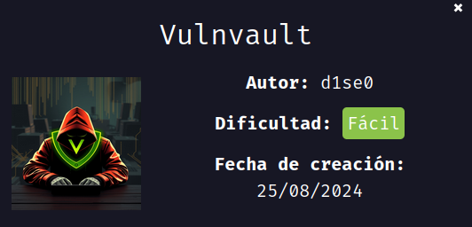

---

## 🖥️ **Despliegue de la máquina**

Descargamos el archivo `vulnvault.zip`, lo descomprimimos y desplegamos la máquina usando el script `auto_deploy.sh` proporcionado. Esto inicia la máquina vulnerable dentro de un contenedor Docker:

```bash
unzip vulnvault.zip
sudo bash auto_deploy.sh vulnvault.tar
```

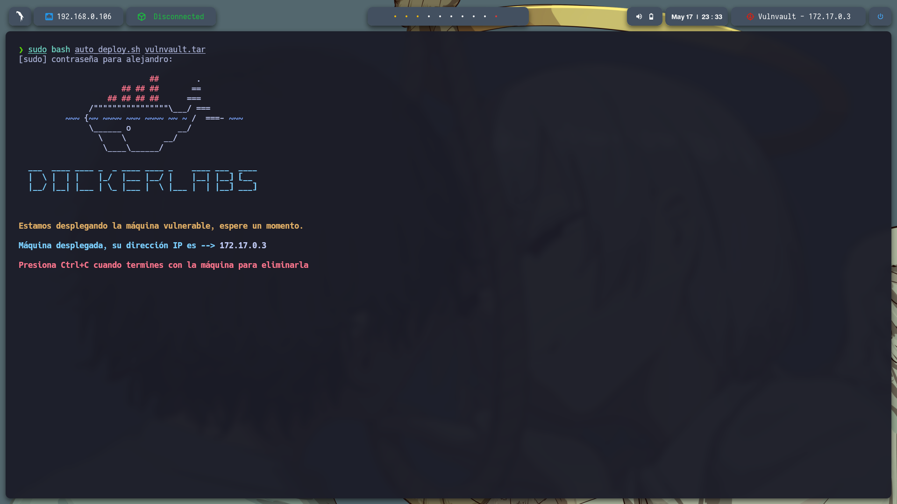

---

## 📡 **Comprobación de conectividad**

Verificamos la conexión con un simple `ping` a la IP asignada (172.17.0.3):

```bash
ping -c1 172.17.0.3
```

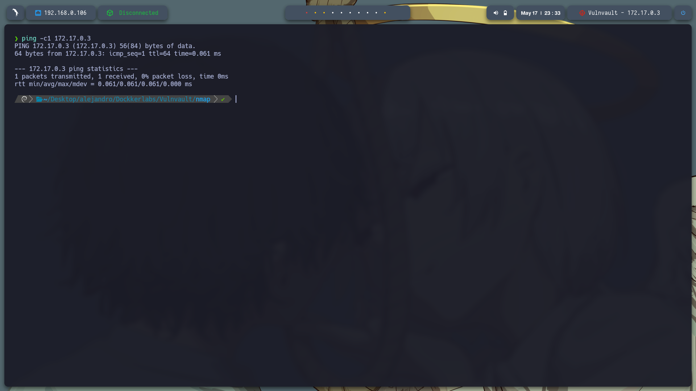

---

## 🔍 **Escaneo de puertos**

Ejecutamos un escaneo de puertos completo con `nmap`:

```bash
sudo nmap -p- --open -sS --min-rate 5000 -vvv -n -Pn 172.17.0.3 -oG allPorts.txt
```

Puertos descubiertos:

* **22/tcp** – SSH
* **80/tcp** – HTTP

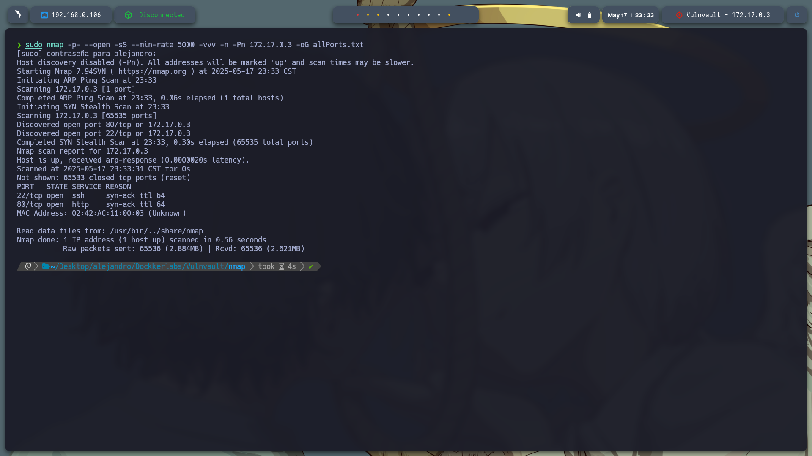

Posteriormente, realizamos un escaneo más detallado sobre los puertos encontrados:

```bash
nmap -sCV -p22,80 172.17.0.3 -oN target.txt
```

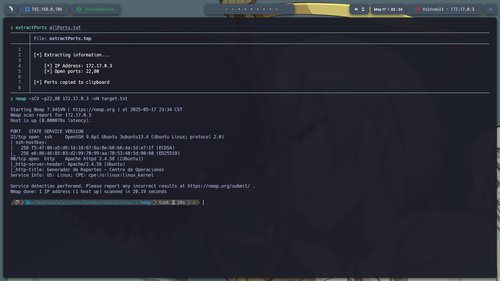

---

Entramos al servico web que se encunetra alojado en http://172.17.0.3/, y es una pagina para generar reportes y podemos subir archivos, voy a intertar hacer un revellshel con php
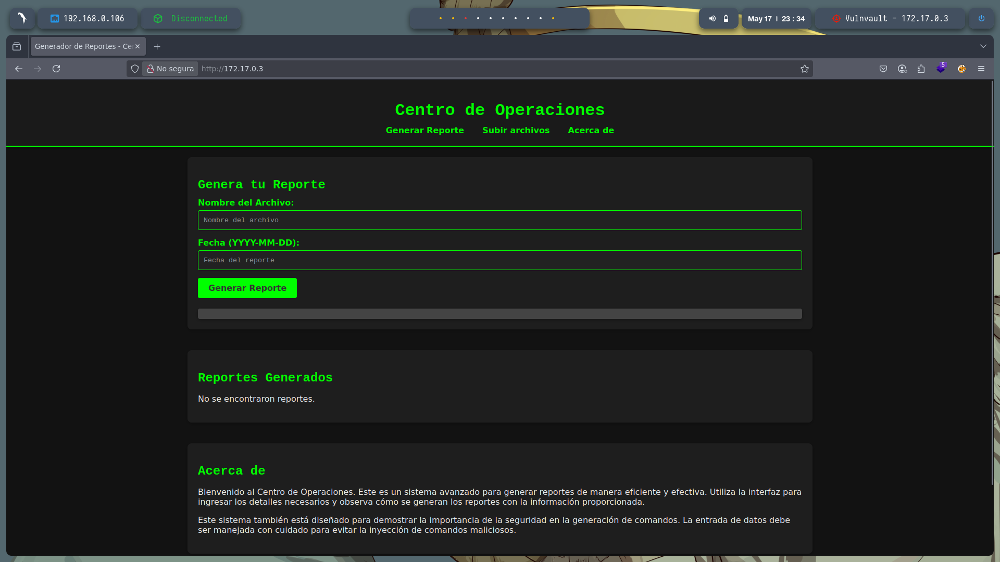

Use gobuster dir -u http://172.17.0.3/ -w /usr/share/seclists/Discovery/Web-Content/directory-list-2.3-medium.txt -t 20 -add-slash -b 403,404 -x php,html,txt para realizar fuzzing y se encontraron:
/index.php            
/upload.html          
/upload.php           
/old      
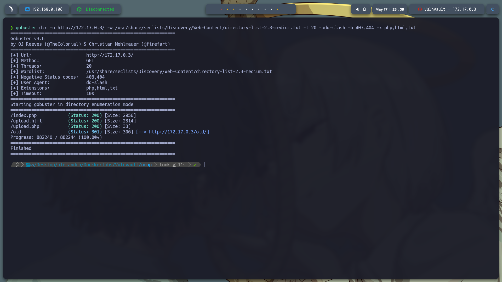

Al revisar todos el que me llamo la atencin fue http://172.17.0.3/upload.php ya que mustra los archivos subidos y aqui podriamos ejecutar nuestro revellshell
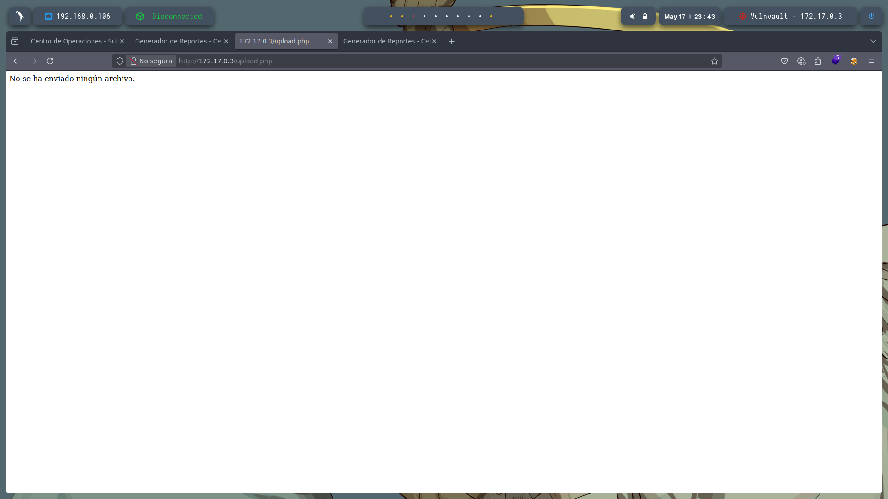

Voy a obtener el .php de https://github.com/pentestmonkey/php-reverse-shell se copia el codigo y se guarga nano revellshell.php, despues se sube el archivo.

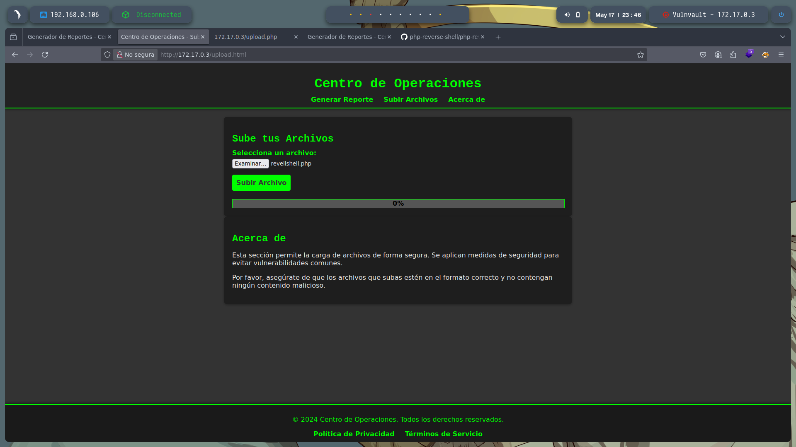

---

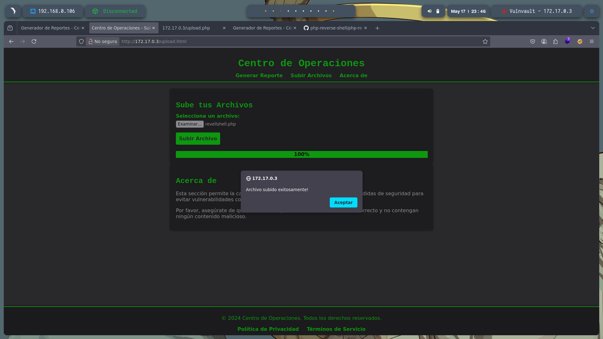

Al subir el archivo no muestra nada despues dek mensaje asi que que se procede a realizar la segunda opcion

Al estar en http://172.17.0.3/index.php y subir un reporte noto que me muestra una ruta donde se guarda el reporte /var/www/html/reportes/reporte_1747547683.txt y en la parte de abajo nos dice que hay que tener cuidado con inyectar comandos maliciosos
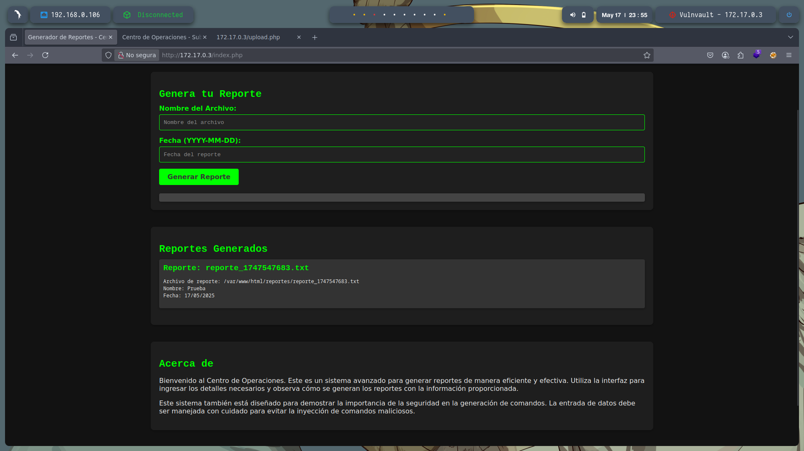

Se probo con varios metodos el que me dio resultado fue en nombre del reporte no es necesario poner algo espesifico y en la fecha el comando que se quiera ejecutar con ; al inicio, yo busque los usuarios que exiate con; ;cat /etc/passwd y se encontro:
samara
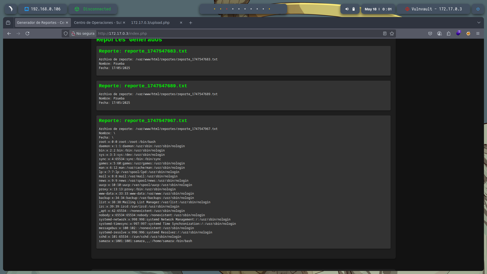

Busque informacion del directorio del usuario encontrado:
;ls -la /home/samara
Y encotre archivos .txt que no pude leer asi que ejecute ;la -la /home/samara/.ssh y encontre el archivo id_rsa lo logre leer con ;cat /home/samara/.ssh/id_rsa copie el archivo y lo pege en mi maquina para su uso
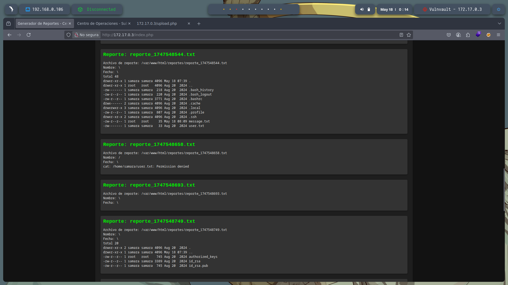

---

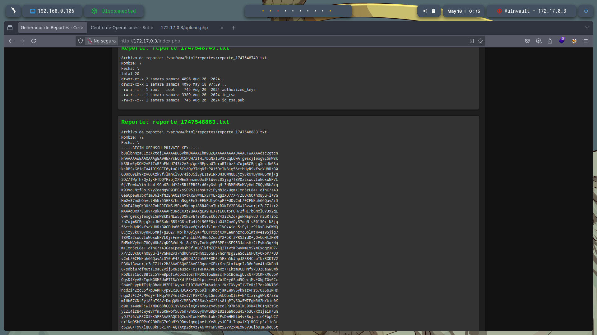

Copias el archivo en nano id_rsa cambiamos los permisos chmod 700 id_rsa y ejecutamos ssh -i id_rsa samara@172.17.0.3 para entrar con exito al servicio SSH
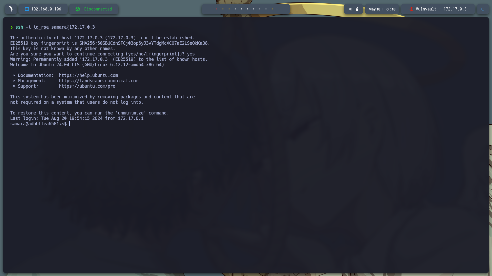


