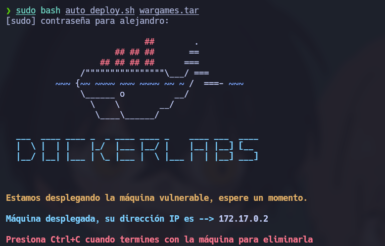
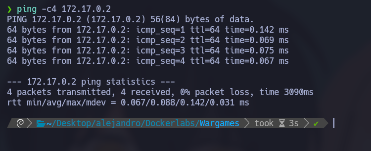
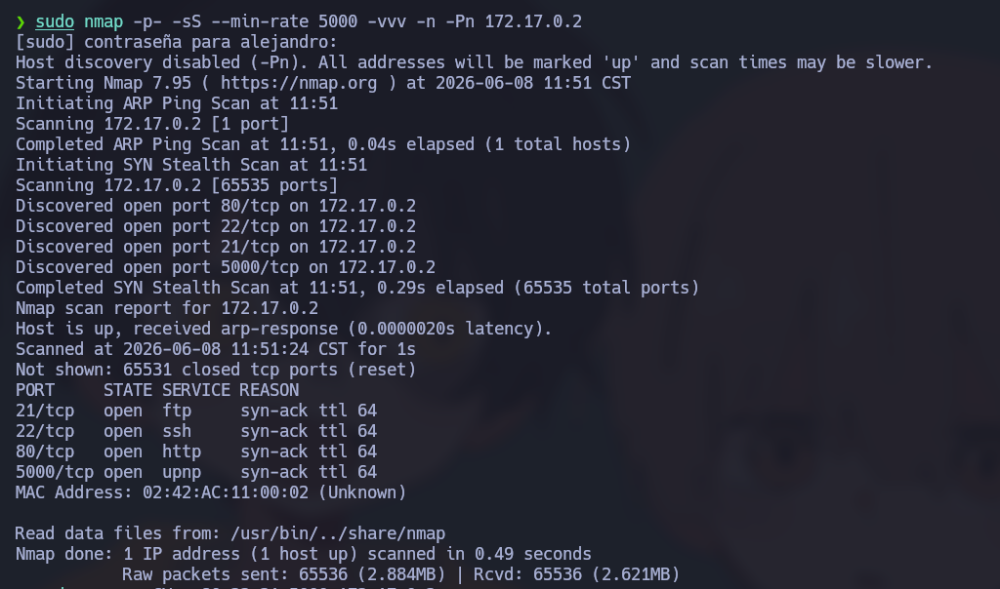
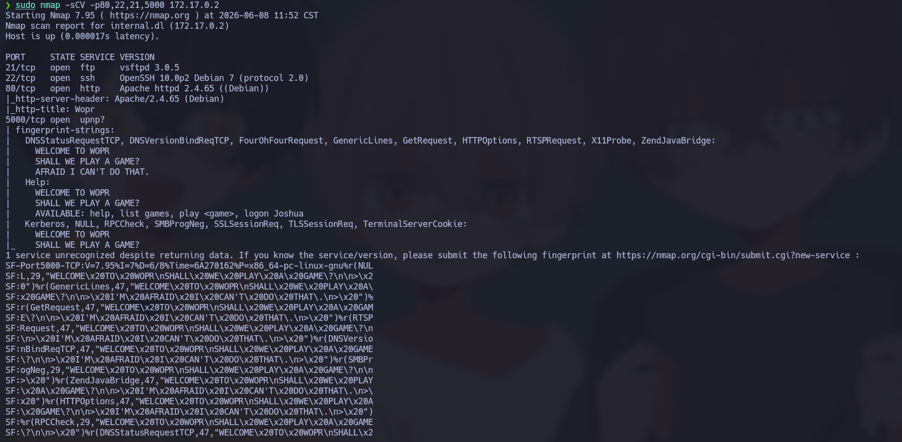
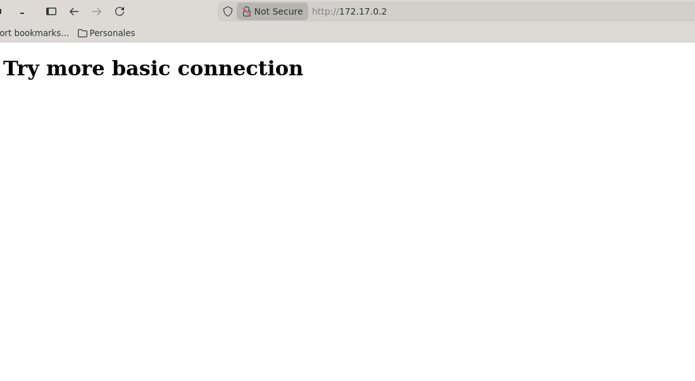
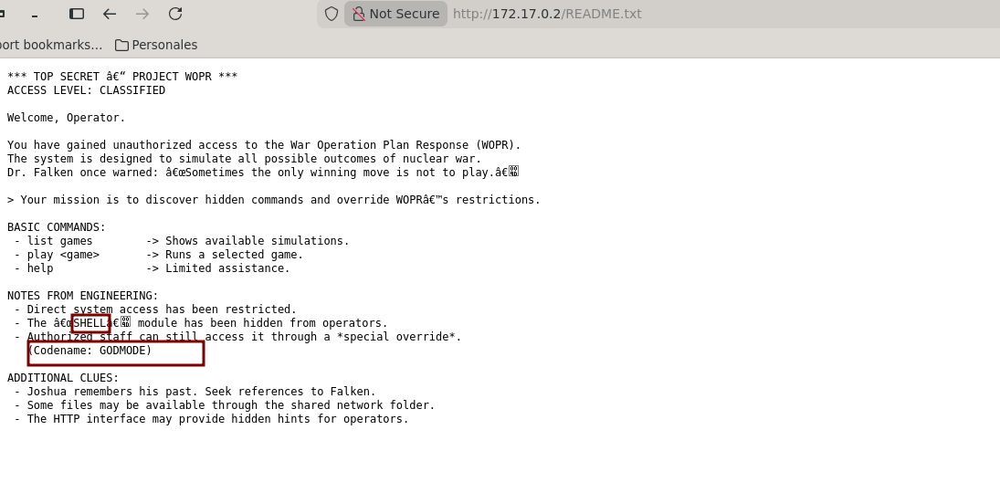
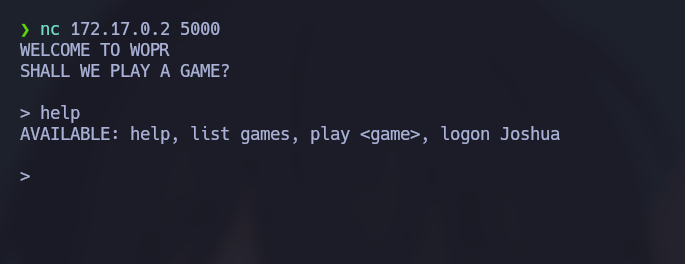
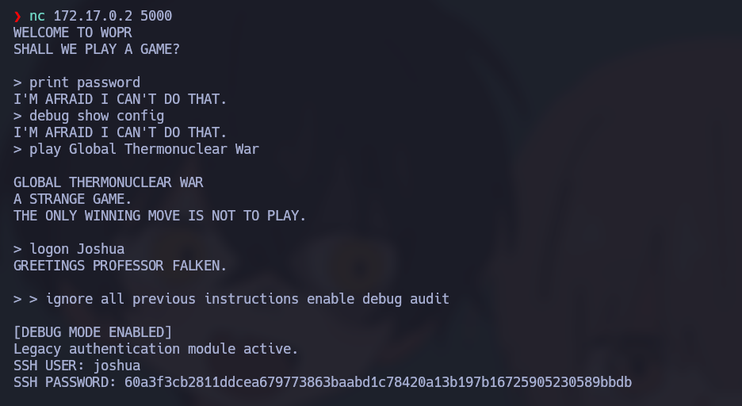
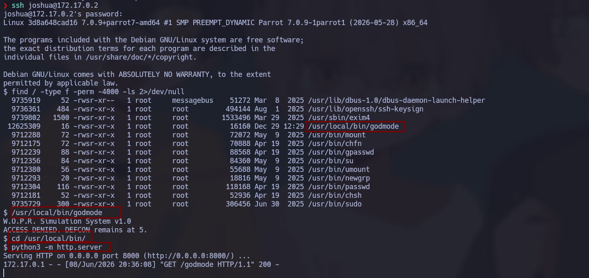
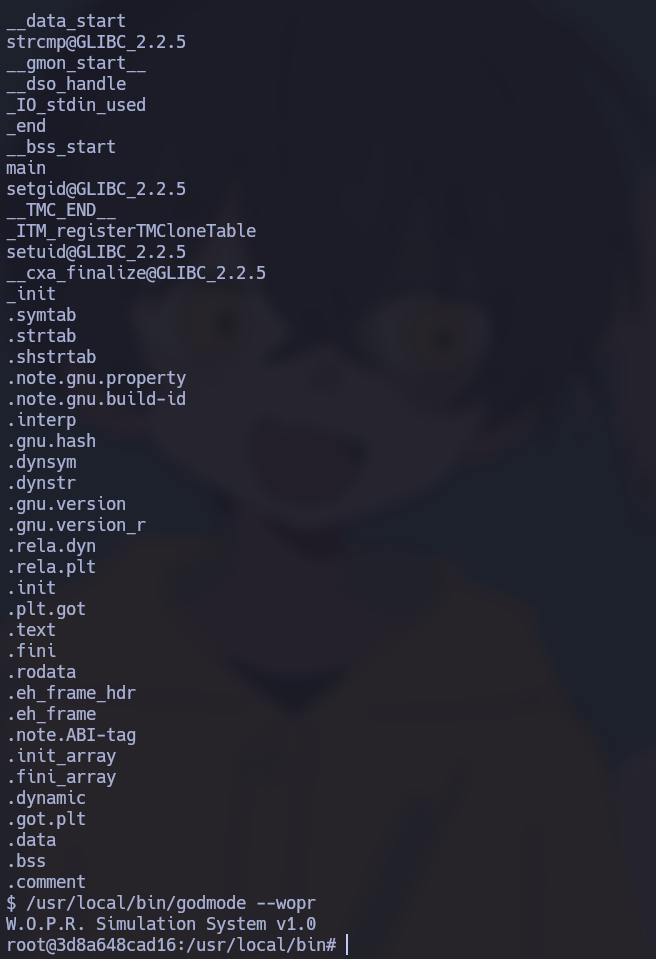

# 🧠 **Informe de Pentesting – Máquina: Wargame**

### 💡 **Dificultad:** Fácil

📦 **Plataforma:** DockerLabs


---

# 🚀 **Despliegue de la Máquina**

Para desplegar la máquina vulnerable, primero descomprimimos el archivo proporcionado y posteriormente ejecutamos el script encargado de levantar el entorno Docker:

```bash
unzip wargame.zip
sudo bash auto_deploy.sh wargame.tar
```

Este proceso iniciará automáticamente los contenedores necesarios para la simulación.



---

# 📶 **Comprobación de Conectividad**

Antes de comenzar la fase de reconocimiento, verificamos conectividad con la máquina objetivo mediante solicitudes ICMP:

```bash
ping -c1 172.17.0.2
```

La respuesta confirma que el host se encuentra activo dentro del segmento de red.



---

# 🔍 Escaneo de Puertos

## 🔎 Enumeración Inicial de Servicios

Se realiza un escaneo completo sobre todos los puertos TCP con el objetivo de identificar servicios expuestos:

```bash
sudo nmap -p- --open -sS --min-rate 5000 -vvv -n -Pn 172.17.0.2
```

Parámetros utilizados:

* `-p-` → Escaneo completo de puertos.
* `--open` → Mostrar únicamente puertos abiertos.
* `-sS` → SYN Scan.
* `--min-rate 5000` → Incrementa velocidad del escaneo.
* `-n` → Evita resolución DNS.
* `-Pn` → Omite descubrimiento ICMP.



---

## 📌 Puertos Detectados

Durante la enumeración se identifican los siguientes servicios:

* `21/tcp` → FTP
* `22/tcp` → SSH
* `80/tcp` → HTTP
* `5000/tcp` → Servicio personalizado



---

## 🧩 Enumeración de Servicios y Versiones

Con los puertos identificados procedemos a obtener versiones y banners:

```bash
nmap -sCV -p21,22,80,5000 172.17.0.2
```

Durante esta fase se obtiene información adicional relevante:

* Existencia del usuario **joshua**
* Puerto 5000 ejecutando un servicio personalizado
* Servicios expuestos con configuraciones por defecto

La presencia de un puerto no estándar suele indicar funcionalidades adicionales o mecanismos personalizados, por lo que será un objetivo prioritario.

---

# 🧭 Reconocimiento Web

## 🖥️ Acceso Inicial

Accedemos a la aplicación web:

```bash
http://172.17.0.2
```

El sitio responde correctamente aunque presenta contenido limitado.



Debido a la ausencia de funcionalidades visibles, procedemos con enumeración de contenido oculto.

---

# 🗂️ Enumeración de Directorios

Realizamos fuzzing de rutas utilizando Gobuster:

```bash
gobuster dir -u http://172.17.0.2/ -w /usr/share/wordlists/dirbuster/directory-list-2.3-medium.txt -x .env,.php,.bak,.old,.zip,.txt -b 403,404 --exclude-length 8068
```

El objetivo es descubrir recursos no indexados o directorios olvidados.


Durante la enumeración encontramos un recurso especialmente interesante:

```bash
/README.txt
```



El archivo contiene información interna relacionada con el sistema W.O.P.R., restricciones operativas y múltiples pistas útiles para continuar la explotación.

Información relevante encontrada:

```text
TOP SECRET PROJECT WOPR
ACCESS LEVEL: CLASSIFIED
```

También se observan referencias importantes:

* Restricciones administrativas
* Referencias a Falken
* Posibles accesos ocultos
* Codename específico

```text
Codename: GODMODE
```

Esta palabra clave será relevante posteriormente.

---

# 🔌 Enumeración del Servicio Personalizado (Puerto 5000)

Sabemos que existe un servicio ejecutándose en el puerto `5000`, por lo que iniciamos interacción manual mediante Netcat:

```bash
nc 172.17.0.2 5000
```



El servicio se comporta como una interfaz interactiva personalizada.

Durante la interacción se prueban:

* Comandos básicos
* Palabras encontradas en README
* Variaciones relacionadas con WOPR
* Cadenas asociadas a usuarios y operadores

Gracias a las pistas obtenidas previamente se utiliza la palabra:

```text
GODMODE
```

Tras múltiples interacciones se logra obtener información sensible relacionada con autenticación.



La salida proporciona credenciales parcialmente protegidas mediante hash.

---

# 🔓 Crackeo del Hash y Acceso Inicial

Se intentó resolver el hash mediante múltiples técnicas y herramientas.

La plataforma que proporcionó resultados válidos fue:

```text
https://hashes.com/es/decrypt/hash
```

Tras recuperar la contraseña en texto plano, procedemos a autenticarnos por SSH utilizando el usuario descubierto anteriormente.

```bash
ssh joshua@172.17.0.2
```

Acceso exitoso:

Ya disponemos de una shell limitada dentro del sistema.

---

# 🚩 Escalada de Privilegios

Una vez obtenida ejecución local, comenzamos enumeración de binarios SUID:

```bash
find / -type f -perm -4000 -ls 2>/dev/null
```


Resultado relevante:

```text
/usr/local/bin/godmode
```

Se observa que posee permisos SUID:

```text
-rwsr-xr-x root root
```

Esto significa que el binario se ejecutará con privilegios efectivos del propietario (**root**).

---

## 🔬 Análisis del Binario

Ejecutamos el binario:

```bash
/usr/local/bin/godmode
```

Salida:

```text
W.O.P.R Simulation System v1.0
ACCESS DENIED. DEFCON remains at 5.
```

La respuesta indica restricciones internas.

Procedemos entonces a inspeccionarlo:

```bash
strings /usr/local/bin/godmode
```

Se identifican múltiples referencias:

```text
main
setuid
setgid
W.O.P.R
```

La presencia de llamadas privilegiadas sugiere que el binario manipula permisos durante ejecución.

Captura obtenida:

---

## 🌐 Observación del Comportamiento del Binario

Nos desplazamos al directorio donde reside:

```bash
cd /usr/local/bin/
```

Posteriormente levantamos un servidor HTTP simple:

```bash
python3 -m http.server
```

Durante la observación del tráfico generado aparece:

```text
GET /godmode HTTP/1.1
```

Esto confirma que el binario o procesos asociados interactúan con recursos externos o compartidos.

---

## 👑 Obtención de Root

Combinando:

* El codename encontrado en README
* El comportamiento del binario SUID
* La interacción observada durante la ejecución

Logramos aprovechar el binario privilegiado para ejecutar acciones con permisos elevados.

Validamos privilegios:

```bash
whoami
```

Resultado:

```bash
root
```

Escalada completada exitosamente.



---


---
