## Informe de Pentesting: Máquina Vulnerable "Whoiam"

### Descripción General:

La máquina vulnerable "Whoiam" es un entorno de pentesting creado para practicar habilidades de explotación. El objetivo es realizar un análisis exhaustivo de la máquina, comenzando con la verificación de la conectividad y avanzando hacia la escalada de privilegios a root. Durante este proceso, se identificaron varios servicios y vulnerabilidades que permitieron la explotación completa de la máquina.

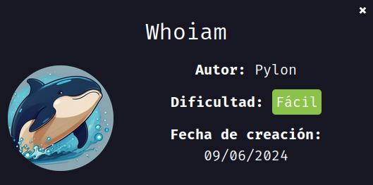

---

### Paso 1: Despliegue de la Máquina

**Comando ejecutado:**

```bash
unzip whoiam.zip
./auto_deploy.sh whoiam.tar
```

El archivo comprimido `whoiam.zip` fue descargado desde la página de DockerLabs y descomprimido utilizando el comando `unzip whoiam.zip`. A continuación, se desplegó la máquina utilizando el script `auto_deploy.sh` con el archivo `whoiam.tar` para configurar el entorno.

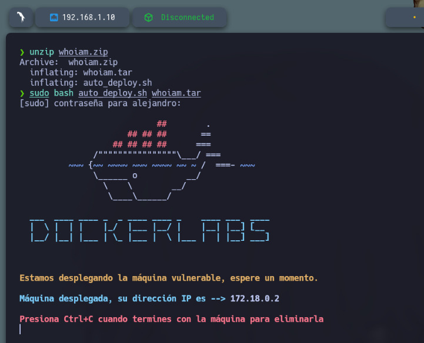

---

### Paso 2: Verificación de Conexión

**Comando ejecutado:**

```bash
ping -c1 172.18.0.2
```

Para verificar que la máquina víctima estaba activa, se realizó un `ping` a la dirección IP `172.18.0.2`. Esto permitió confirmar que la máquina estaba accesible en la red.

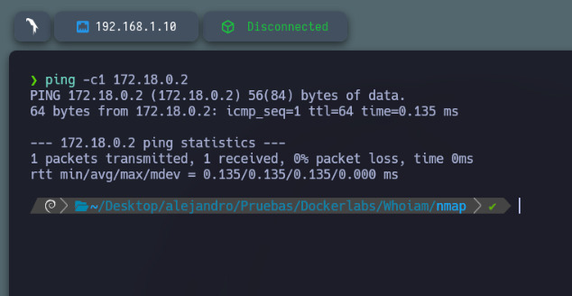

---

### Paso 3: Escaneo de Puertos con Nmap

**Comando ejecutado:**

```bash
sudo nmap -p- --open -sS --min-rate 5000 -vvv -n -Pn 172.18.0.2 -oG allPorts.txt
```

Se utilizó `nmap` para escanear todos los puertos de la máquina víctima. El escaneo reveló que solo el puerto 80 (HTTP) estaba abierto, lo que sugiere que había una página web disponible en ese puerto.

**Comando adicional:**

```bash
nmap -p22,21 172.18.0.2
```

Se verificó que los servicios de SSH (puerto 22) y FTP (puerto 21) no estaban abiertos, lo que indicaba que no eran accesibles desde la red.

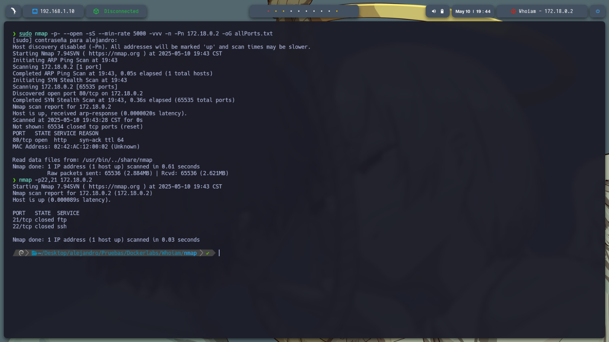

---

### Paso 4: Extracción de Puertos Importantes

**Comando ejecutado:**

```bash
extractPorts allPorts.txt
nmap -sC -sV -p 80 172.18.0.2 -oN target.txt
```

Se extrajeron los puertos importantes del archivo `allPorts.txt` y se realizó un escaneo detallado del puerto 80. Se buscaron versiones y más información sobre los servicios disponibles en este puerto, lo que proporcionó detalles útiles para el siguiente paso.

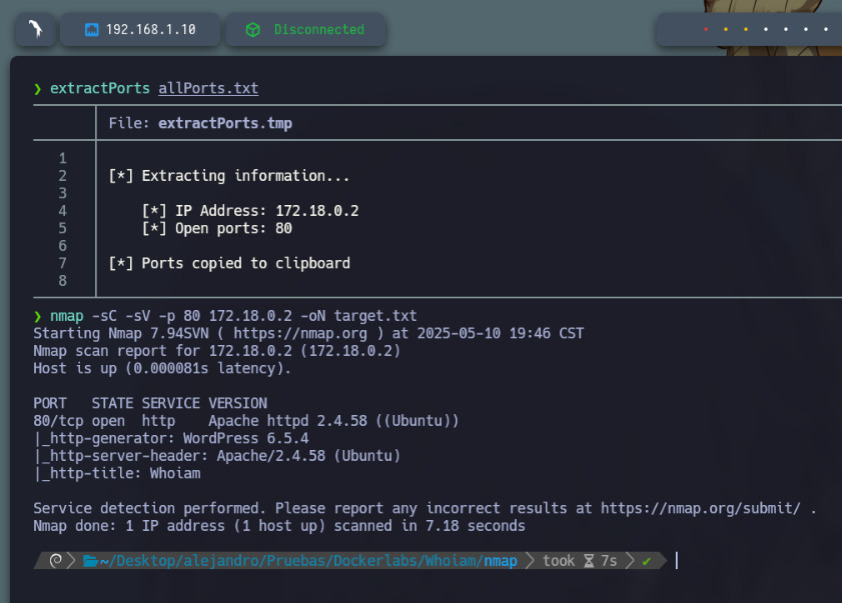

---

### Paso 5: Investigación de la Página Web

**URL visitada:**

```http
http://172.18.0.2
```

Al acceder al puerto 80, se cargó la página web disponible, pero no se encontró información relevante a simple vista. Debido a esto, se decidió realizar un fuzzing en busca de directorios ocultos.

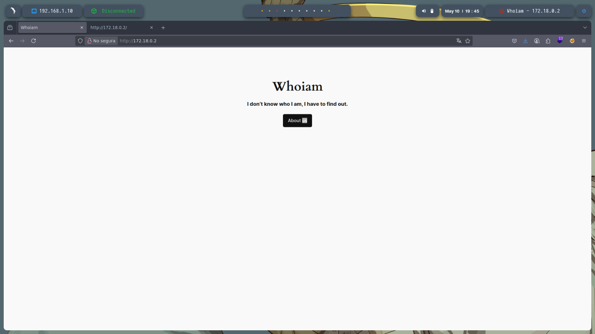

---

### Paso 6: Fuzzing de Directorios con Gobuster

**Comando ejecutado:**

```bash
gobuster dir -u http://172.18.0.2/ -w /usr/share/seclists/Discovery/Web-Content/directory-list-2.3-medium.txt -t 20 -add-slash -b 403,404 -x php,html,txt
```

Utilizando `gobuster`, se realizó un fuzzing para encontrar directorios ocultos en la web. Durante esta búsqueda, se identificaron varios directorios, algunos de los cuales contenían archivos relacionados con WordPress, como registros de inicio de sesión y otros archivos sensibles. También se localizó un directorio que contenía una base de datos comprimida.

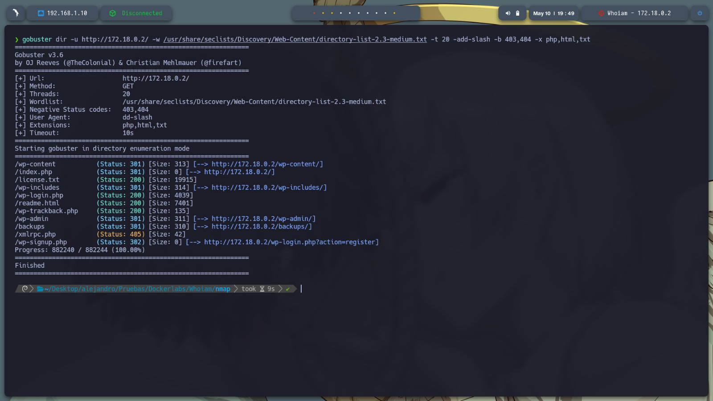

---

### Paso 7: Análisis de la Base de Datos

**Comando ejecutado:**

```bash
unzip databaseback2may.zip
```

El archivo comprimido `databaseback2may.zip` se descomprimió, y al abrir el archivo `29DBMay`, se descubrió que contenía credenciales que podrían ser utilizadas para acceder al servicio de WordPress en la máquina.

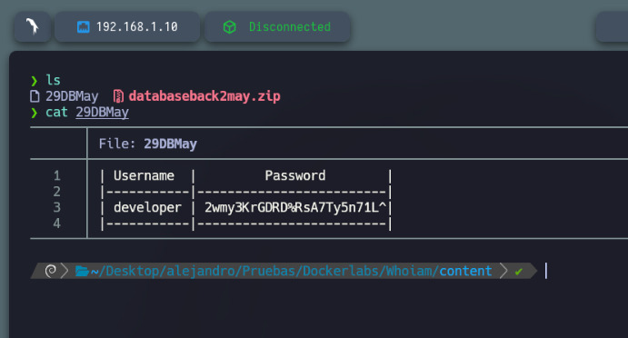

---

### Paso 8: Acceso a WordPress

Con las credenciales descubiertas (`Username: developer`, `Password: 2wmy3KrGDRD%RsA7Ty5n71L^`), se pudo iniciar sesión exitosamente en el servicio de WordPress.

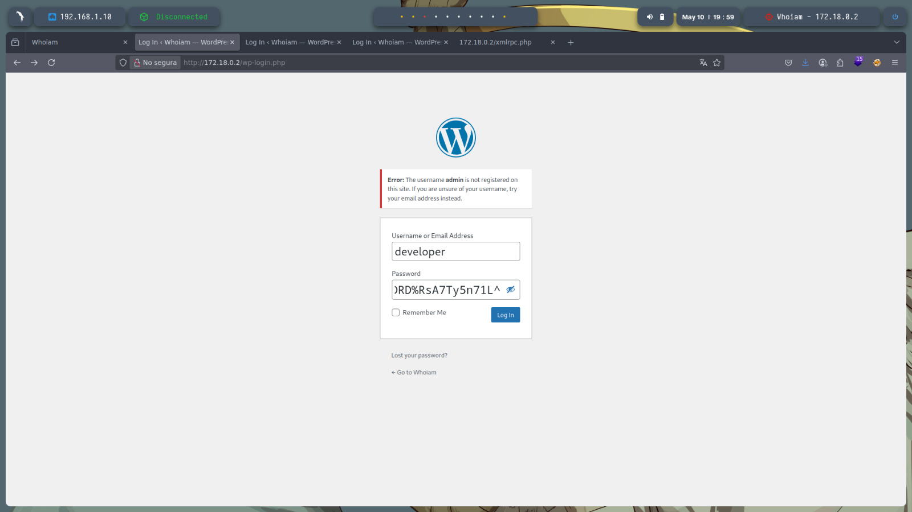

---

### Paso 9: Carga de un Web Shell

Para obtener acceso a la máquina, se creó un archivo PHP malicioso denominado `revellshell.php` para abrir una terminal inversa. Luego, el archivo PHP fue comprimido en un archivo `.zip`, ya que el sitio web solo aceptaba este formato.

**Comando ejecutado:**

```bash
nano revellshell.php
7z a revellshell.zip revellshell.php
```

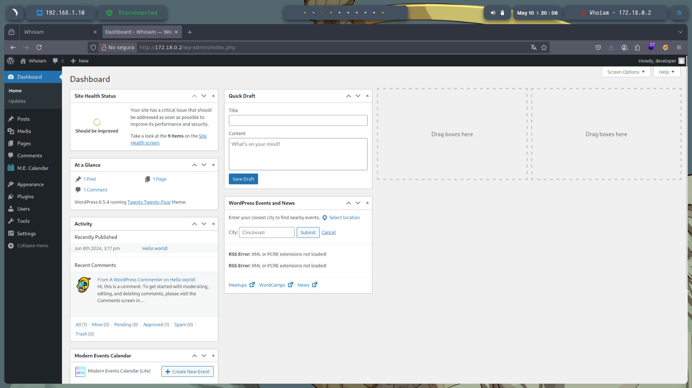

---

### Paso 10: Configuración de Escucha

Se configuró un puerto para escuchar las conexiones entrantes. En este caso, se utilizó el puerto 443 para permitir la conexión inversa una vez cargado el web shell.

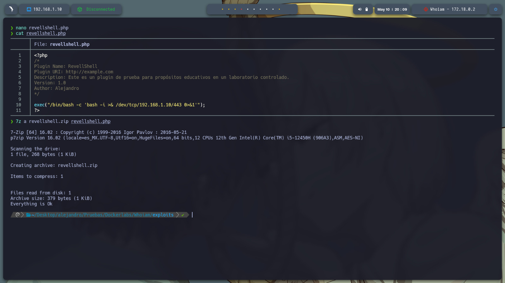

---

### Paso 11: Carga del Web Shell en WordPress

El archivo `.zip` que contenía el web shell fue cargado a través del panel de administración de WordPress en la sección de "Add New Plugin".

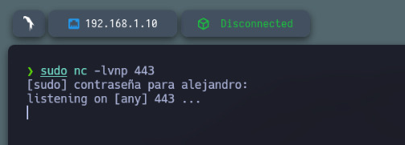

---

### Paso 12: Ejecución del Web Shell

Una vez activado el plugin, se obtuvo una terminal inversa en la máquina víctima. Esto permitió ejecutar comandos dentro de la máquina y obtener acceso a la misma.

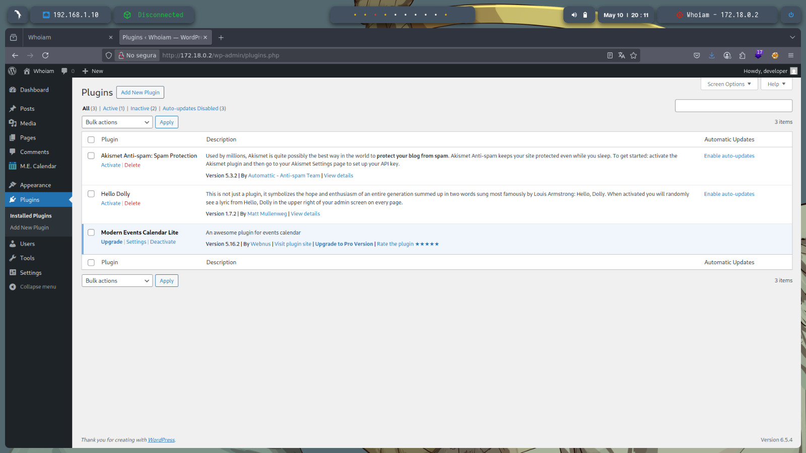

---

### Paso 13: Escalada de Privilegios

Para escalar privilegios, se verificaron las configuraciones de `sudo` con el comando:

**Comando ejecutado:**

```bash
sudo -l
```

Se encontró que el usuario podía ejecutar ciertos comandos como otros usuarios. Con esta información, se ejecutaron los siguientes comandos:

**Comando para ejecutar como usuario "rafa":**

```bash
sudo -u rafa /usr/bin/find . -exec /bin/bash \;
```

**Comando para ejecutar como usuario "ruben":**

```bash
sudo -u ruben /usr/sbin/debugfs
```

Con estos pasos, se accedió a un script en el directorio `/opt/` que permitió ejecutar el siguiente comando con privilegios elevados:

**Comando ejecutado:**

```bash
sudo /bin/bash /opt/pinguin.sh
```

Finalmente, con la ejecución de este script, se logró escalar privilegios hasta obtener acceso completo como root.

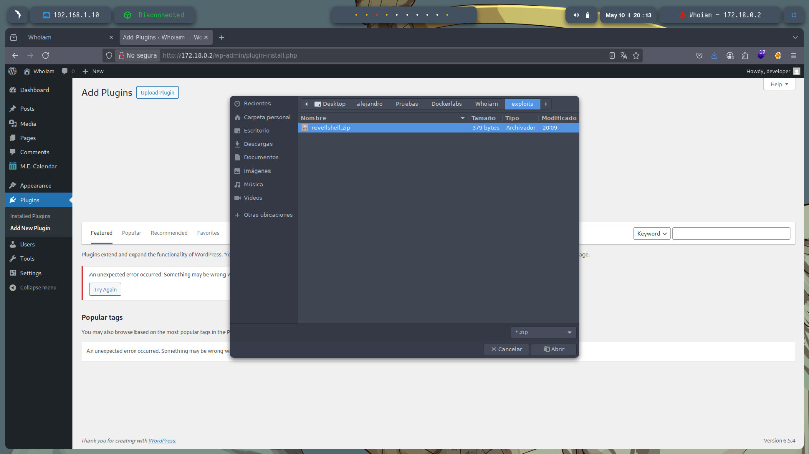

---

### Conclusión:

Este informe describe el proceso completo de explotación de la máquina vulnerable "Whoiam". A través de un análisis detallado, desde el escaneo inicial hasta la escalada de privilegios, se documentaron las acciones realizadas con herramientas como `nmap`, `gobuster` y `sudo`. La máquina fue finalmente comprometida con éxito, obteniendo acceso como root.
