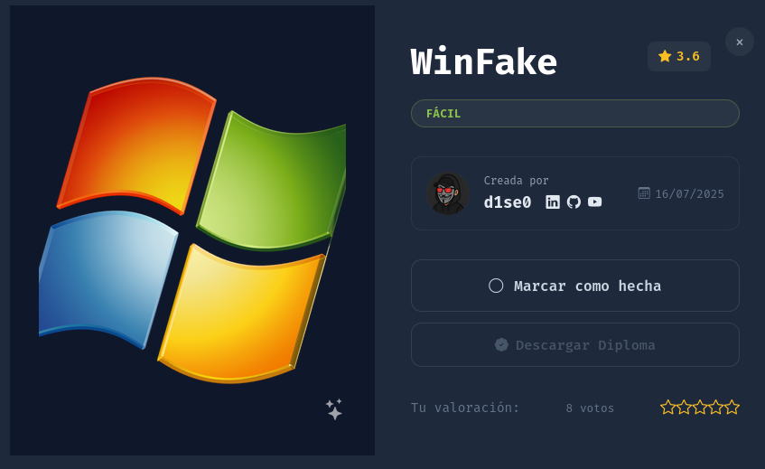
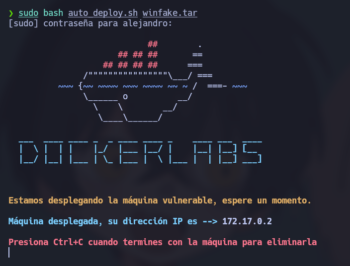
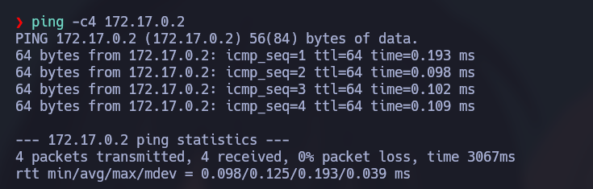
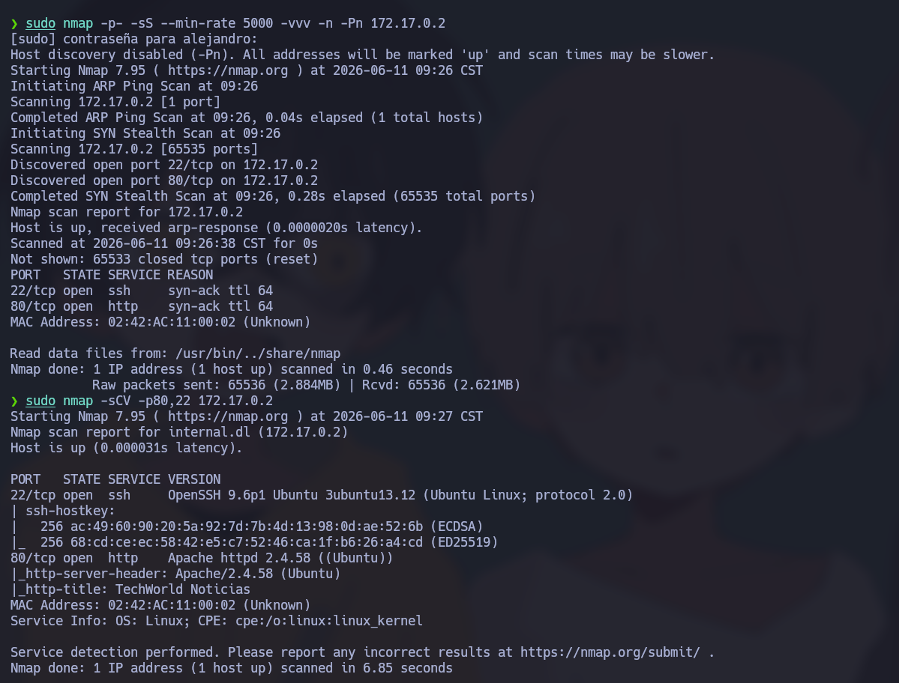
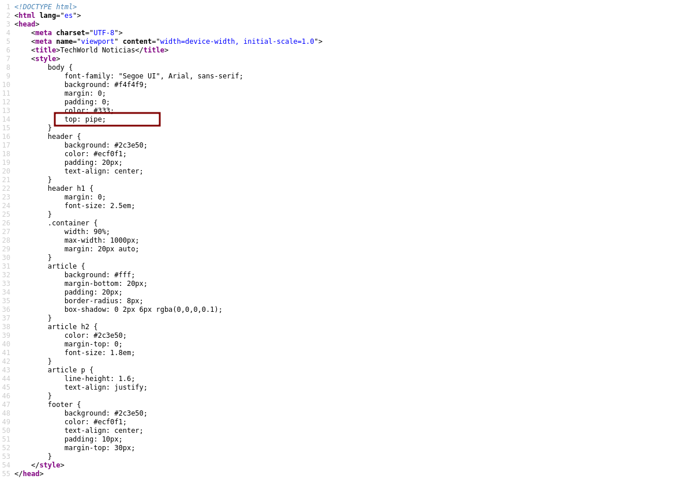
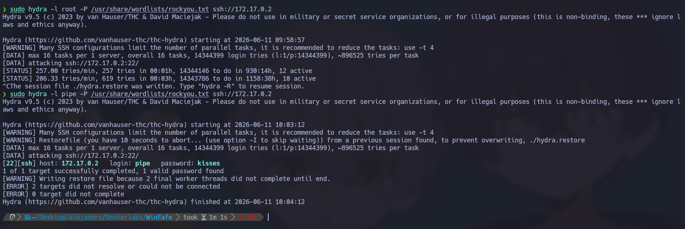
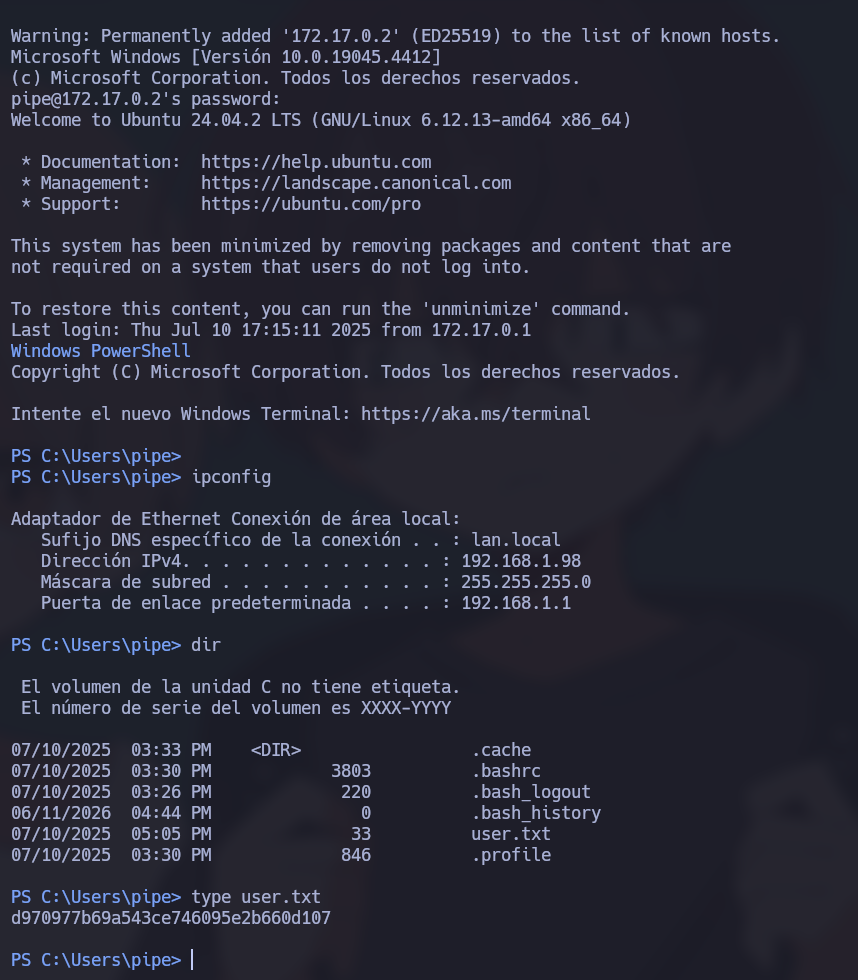
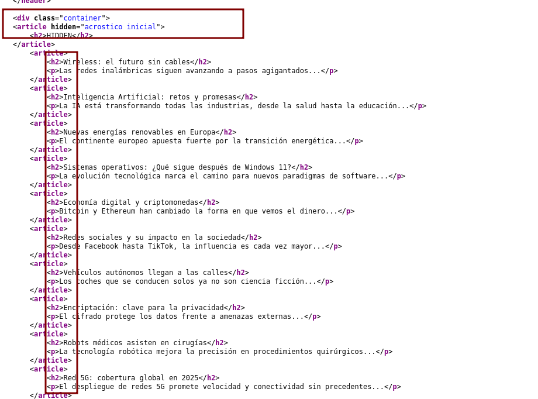
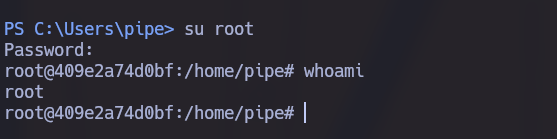

# 🧠 Informe de Pentesting – Máquina: WinFake

### 💡 Dificultad: Fácil

📦 Plataforma: DockerLabs



---

# 🚀 Despliegue de la Máquina

Para iniciar la máquina vulnerable, primero descomprimimos el archivo proporcionado y posteriormente ejecutamos el script de despliegue:

```bash
unzip grooti.zip
sudo bash auto_deploy.sh grooti.tar
```



---

# 📶 Comprobación de Conectividad

Una vez desplegada la máquina, verificamos que el objetivo se encuentre activo y responda correctamente a peticiones ICMP:

```bash
ping -c1 172.17.0.2
```

La respuesta recibida confirma que la máquina está encendida y accesible dentro de la red del laboratorio.



---

# 🔍 Enumeración de Puertos y Servicios

## 🔎 Escaneo Completo de Puertos

Comenzamos realizando un escaneo completo de todos los puertos TCP con el objetivo de identificar los servicios expuestos:

```bash
sudo nmap -p- --open -sS --min-rate 5000 -vvv -n -Pn 172.17.0.2
```

### 📌 Puertos Abiertos Detectados

| Puerto | Servicio |
| ------ | -------- |
| 22/tcp | SSH      |
| 80/tcp | HTTP     |

---

## 🧩 Enumeración de Servicios y Versiones

Una vez identificados los puertos abiertos, realizamos un análisis más detallado para obtener información sobre las versiones y configuraciones de los servicios detectados:

```bash
nmap -sCV -p22,80 172.17.0.2
```

Este procedimiento permite identificar versiones, configuraciones específicas y posibles vectores de ataque asociados a cada servicio.



---

# 🌐 Reconocimiento Web

## 🖥️ Análisis Inicial de la Aplicación

Accedemos al servicio web desde el navegador:

```bash
http://172.17.0.2
```

La página carga correctamente y muestra una aplicación web aparentemente funcional.


Durante la fase de reconocimiento se revisó el código fuente de la página mediante la combinación de teclas **CTRL + U**. En dicho código se observó una referencia al término **pipe**, el cual no parecía corresponder a ninguna variable o elemento utilizado por la aplicación.

Se realizaron diversas pruebas de enumeración, incluyendo fuzzing de directorios y parámetros, sin obtener resultados relevantes.



Considerando que el servicio SSH se encontraba expuesto y que *pipe* podría tratarse de un nombre de usuario válido, se decidió realizar un ataque de fuerza bruta sobre dicho servicio utilizando Hydra.

```bash
sudo hydra -l pipe -P /usr/share/wordlists/rockyou.txt ssh://172.17.0.2
```

Tras varios intentos se obtuvieron credenciales válidas:

```text
Usuario: pipe
Contraseña: kisses
```



---

# 🖥️ Acceso Inicial

Una vez autenticados mediante SSH, observamos que el entorno simulaba una terminal de Windows. Durante la exploración inicial se localizó un archivo de texto que contenía la primera flag de la máquina.



---

# 🔐 Escalada de Privilegios

Después de realizar una enumeración básica sin encontrar vectores evidentes de escalada, se volvió a inspeccionar el código fuente de la aplicación web.

En esta revisión se encontró una pista que indicaba:

```text
acrostico inicial en las HIDDEN
```

Analizando los elementos ocultos (*hidden*) y tomando únicamente las letras o palabras iniciales correspondientes, se obtuvo la siguiente cadena:

```text
WINSERVERROOTFAKENEWS
```



Inicialmente se intentó utilizar dicha cadena como contraseña para el usuario **root**, sin éxito:

```text
root:WINSERVERROOTFAKENEWS
```

Observando el patrón de la cadena y considerando posibles variaciones de mayúsculas y minúsculas, se generaron diferentes combinaciones hasta encontrar la credencial correcta:

```text
Usuario: root
Contraseña: WinServerRootFakeNews
```

Con estas credenciales fue posible obtener acceso privilegiado al sistema.



---
